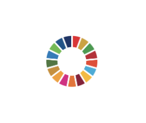
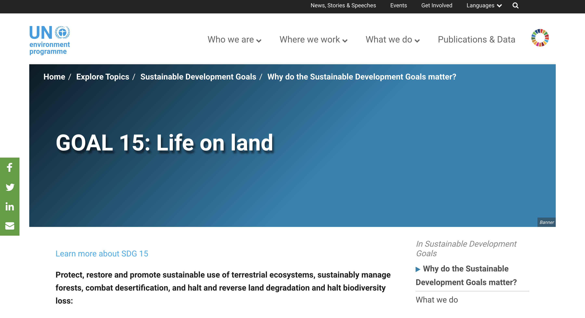
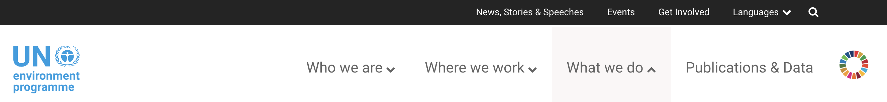
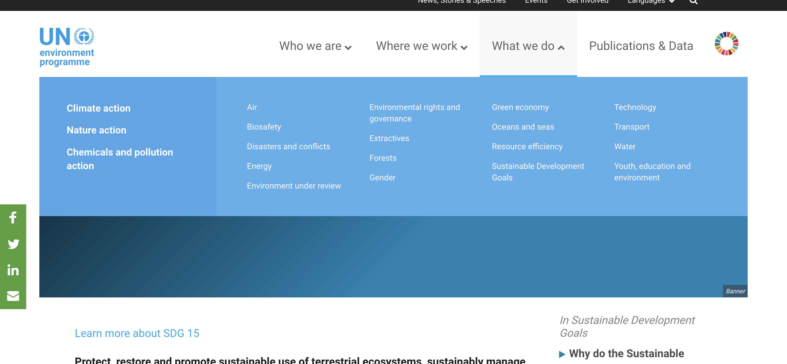
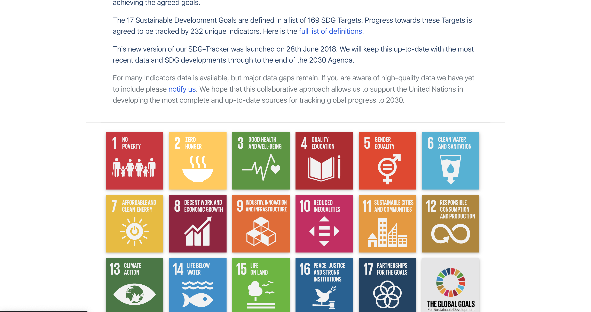
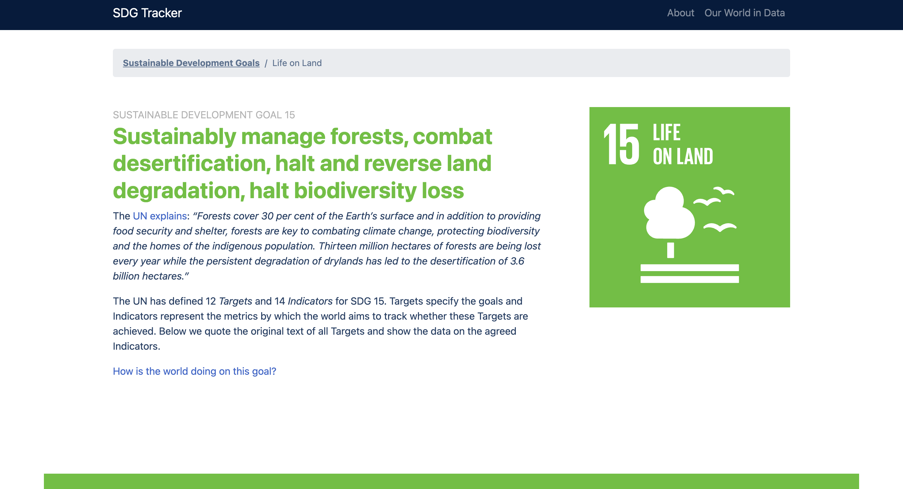
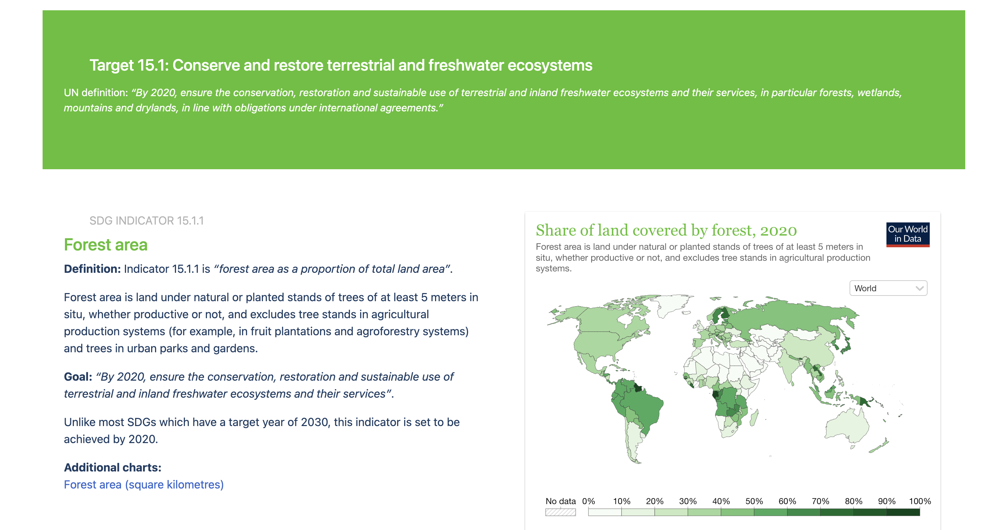

# Protecting & Promoting Sustainable Use of Ecosystems, Forests, Compating Desertification, Halting/Reversing Land Degradation, and Halting Biodiversity Loss

## Assignment 1: Heuristic Evaluation

Dhruv Purohit | DH110 | Fall 2022

### About the project

The United Nations (UN) has a list of 17 Sustainable Development Goals, one of which is entitled "Life on Land" (Goal 15). According to the UN, the objective of this goal is to "protect, restore and promote sustainable use of terrestrial ecosystems, sustainably manage forests, combat desertification, and halt and reverse land degradation and halt biodiversity loss." For this project, I will be focusing on analyzing user interface and design aspects that would enable people all over the world to learn more and become more aware of this particular sustainability goal.  

### Jakob Nielson's [10 Usability Heuristics](https://www.nngroup.com/articles/ten-usability-heuristics/) 

| Number | Heuristic | Description |
|---|---|---|
| 1 | Visibility of System Status | The design should always keep users informed about what is going on, and give timely and appropriate feedback |
| 2 | Match Between System and the Real World | The design should be familiar to the user, not something too difficult to understand |
| 3 | User Control and Freedom | The design has functions that allows users to undo or redo their actions |
| 4 | Consistency and Standards | The design and use of words is streamlines and easy to understand |
| 5 | Error Prevention | Remove error-prone conditions and provide users with safety nets/confirmation for high-cost errors |
| 6 | Recognition Rather Than Recall | Minimize the user's memory load by giving them suggestions and context to what they have to do |
| 7 | Flexibility and Efficiency of Use | Provide numerous ways to perform a task and include shortcuts to increase accessibility |
| 8 | Aesthetic and Minimalist Design | Provide relevant content/features and keep things to a minimum |
| 9 | Help Users Recognize, Diagnose, and Recover From Errors | Aid users in telling them any issues/problems |
| 10 | Help and Documentation | Supply users with extra resources, such as a search, chat, or guide, to help them complete tasks |

### [Severity Ratings](https://www.nngroup.com/articles/how-to-rate-the-severity-of-usability-problems/) for Usability Problems by Nielsen Norman Group

The following rating scale is being used to evaluate the severity of usability issues:
| Rating | Description |
|---|---|
| 1 | Cosmetic problem only: need not be fixed unless extra time is available on project |
| 2 | Minor usability problem: fixing this should be given low priority |
| 3 | Major usability problem: important to fix, so should be given high priority |

Ratings are displayed in parentheses after each usability issue.

## Website 1: [UN Environment Programme](https://www.unep.org/explore-topics/sustainable-development-goals/why-do-sustainable-development-goals-matter/goal-15)

### About the Website & Initial Evaluation
[UN Environment Programme](https://www.unep.org/explore-topics/sustainable-development-goals/why-do-sustainable-development-goals-matter/goal-15) is a site that enables users to discover more about UN environmental programs. It has many pages on the goals outlined by the UN, and resources for people.  At initial glance, the website seems functional and informative. Read on to see the issues users may experience with this site.

### Heuristic Evaluation

#### 1. Visibility of System Status
* The site does a fairly good job of making elements visible. The tabs at the top of the page make it clear where sub-pages are located and what topics are located under each sub-category. However, upon clicking one of those tabs (specifically the "What We Do" tab) it is not clear how the elements on the right side relate to the three categories on the left (climate action, nature action, and chemical and pollution actions). (2) 

  

> *Recommendation: Get the search bar to work and respond timely to users. Addiitonally, re-design thhe breakdown of what is listed under each tab at the top of the home page. 
#### 2. Match Between System and the Real World
* The majority of the website speaks well to the user and is not confusing/difficult to understand. One element that stands out to me is the colorful wheel in the top right corner. The user does not know about the function of this button until after they have clicked it. This leads to error issues and potentially confusing the user. There are descriptions on each page which provide context to the goal, however, the visuals are difficult to understand. (3) 

  

> *Recommendation: Provide a written meaning of this colorful button and improve visuals. 
#### 3. User Control and Freedom
* The user has a lot of freedom on the site. Should users make a mistake, they will have to utilize the back arrows on their browser. (N/A)

> *Recommendation: None
#### 4. Consistency and Standards
* The design on individual pages does not match that of the home page. The home page appears organized and structured, however, certain individual pages are disorganized and are not aesthetically pleasing. Additionally, there is not total consistency among all the menu items on the top bar. (3)

  

> *Recommendation: Make all the pages consistent, and not like they are appearing out of nowhere. Ensure that the top bar is consistent in terms of design and where users are being directed. 
#### 5. Error Prevention
* When going through the site, there did not appear to be areas where users were warned about potential mistakes that they may make. I experienced continued issues with the search window not working. Issues like this are problematic. (2)

> *Recommendation: Ensure that all buttons and links function properly, as not not confuse users about each button's purpose. 
#### 6. Recognition Rather Than Recall
* The layout of the website is decent, however it requires users to really know where things are. If a user wants to get to a certain page, they will be forced to remember how to get there as the website pages are slightly complex. (2)

> *Recommendation: Make navigating the website through menus easier and more functional. 
#### 7. Flexibility and Efficiency of Use
* Overall, the website is not efficient. The non-functional and non-descriptive parts of the website are not user friendly. Additionally, it appears that there are two menu bars. This makes it appear that information and user interactions with the website are being put into different parts. This makes navigating pages more difficult. (3)

  

> *Recommendation: Improve the menu bars and where users go when they want to access items on the webpage. Make the location of items more clear to the user. 
#### 8. Aesthetic and Minimalist Design
* Overall, the design is poor. Overall, interacting with the website as the whole is dry and not user friendly and interactive. (3)

  

> *Recommendation: Create a more consistent aesthetic design across all pages. 
#### 9. Help Users Recognize, Diagnose, and Recover From Errors
* There are no apparent areas where the users will be stopped because of an error on the user end. The contact us page does not have direct inputs for an email message, but rather directs the user to copy contact info from the site for their own use. However, at the bottom of the page, upon clicking the button "Subscribe for Our Newsletter," it appears that no fields are marked with an asterisk and/or actually required. This could result in a faulty system and mislead the user. (3) 

> *Recommendation: Ensuring (1) that there are sufficient user input areas and (2) that each user input area clearly identifies what fields are required for successful processing. 
#### 10. Help and Documentation
* The search bar is non-functional. Additionally, there are no other guides to help users interact with the webpages. (3)

> *Recommendation: Make the search bar functional and ensure that users can engage with the pages in a way that is guided by elements on the page. 
### Overall Assessment
While the website appears great at first look, breaking it down reveals that there are many issues and that the site is far from user friendly. However, the overall organization is extremely poor. As a user, it would be frustrating to navigate this site from the start, and it needs many improvements, Besides improving the aesthetics, the functionality of menu bars and where information is located needs to be improved. Additionally, the pages should be more interactive and easier to understand. 

## Website 2: [SDG Tracker](https://sdg-tracker.org/biodiversity)

### About the Website & Initial Evaluation
[SDG Tracker](https://sdg-tracker.org/biodiversity) is a website that uses data visualizations to show progress towards the goals outlined by the UN. The site does not give too much information, however, it contains so much data from the site "Our World in Data." Read on to see the issues users may experience with this site.

### Heuristic Evaluation

#### 1. Visibility of System Status
* The site is more or less endless. The site is designed such that as you keep scrolling, you just keep seeing more short descriptions paired with data charts. With this continuous scroll, you have the potential to lose your reader's interest. The site doesn't contain many other pages, except a similar such data page for each goal. Therefore, this issue applies to all the individual goals' pages. (3)

  

> *Recommendation: Display a progress bar or even better, have different tabs for the various targets that are listed above each data point. 
#### 2. Match Between System and the Real World
* At the top of the webpage, there is a short description/intro into what the goal is briefly about. However, it lacks sufficient back story on the purpose of all the data it's presenting. This applies to each goal listed on the home page. The words and data need a better and more robust backstory and description. (2)

  

> *Recommendation: None!
#### 3. User Control and Freedom
* Clicking the tab "Our World in Data" at the top bar leads the user to a new page. It does not prompt the user that they are being re-directed to a new page. (2)

> *Recommendation: Let the user know when you take them from your site to another. 
#### 4. Consistency and Standards
* The website is consistent in all of its pages. It follows the consistent trend of a brief description followed by listing all the targets and respective  data charts. Each page experiences the same issues outlined above. Overall, there are no consistency standards or surprises to the user. The overall design of the pages could be greatly improved. (1) 

  

> *Recommendation: While the display is consistant, the design lacks being able to provide the user with an easy way to interact with the data. 
#### 5. Error Prevention
* There is no search bar, and since the website is not used beyond displaying information, there aren't too many errors that the user can make. However, when observing the data, if they click the "Our World in Data" logo, a new tab will open with a link to that website. This may surprise users, and there is no notice letting them know this. When clicking on other parts of the data on the maps, there are no issues that would lead to errors for the user. (2)

> *Recommendation: Oevrall, deisgn is good as it pertains to error prevention. However, letting the user know a new tab is opening may be helpful. 
#### 6. Recognition Rather Than Recall
* The top of the page, there is a hyperlinked tab that takes the user back to the home page. However, this is not clear. The user must either know or experiment with this to see where clicking "Sustainable Development Goals'' will take them. It would be much better for the user to have more tabs at the top of the site, rather than embedded within the actual page. (3)

  

> *Recommendation: Create a more robust top bar, with additional tabs so the user can be more informed about where they are navigating to. 
#### 7. Flexibility and Efficiency of Use
* Beyond scrolling, zooming in and out on the maps, and using a cursor to view additional statistics on the maps, there is not any efficiency issues with the site. (1)

> *Recommendation: None!
#### 8. Aesthetic and Minimalist Design
* The design is poor to say the least. The website is very basic and does not provide the user with a dynamic design. While the design is minimalist, it has eliminated aspects that maintain proper aesthetics and minimalist design. The home page looks colorful and user friendly, however, upon clicking on any of the boxes (each goal has a box), it is clear that there is not too much purpose behind the design. Beyond scrolling through the endless data visualizations, there is no additional user interaction. (3)

> *Recommendation: This site needs an entire re-design. While the site seems simple, it lacks user interaction, making it dry and boring. Adding more features and aesthetics to the design will improve the site tremendously. 
#### 9. Help Users Recognize, Diagnose, and Recover From Errors
* Once a user has clicked anywhere on the site (including the links that lead to the site "Our World in Data"), it is not possible to go back, other than clicking the back arrow on the browser. Beyond this issues, there are not many errors that the user can make. (2)

> *Recommendation: None!
#### 10. Help and Documentation
* The website does not provide the user with any help or steps to navigate the web pages. The user has no search option, leaving to only manually discover each page. This is not efficient. (2)

> *Recommendation: Since there is so much data being presented, it should be organized better. Additionally, a search option should be added. 
### Overall Assessment

This site has a very simple and basic design that serves the purpose of displaying information, but makes interactions with the user difficult. While it has valuable data, there is not much of a story behind everything that is going on and being presented. What is written is not visually appealing to read and interact with. Utilizing data from other sites and areas would improve the site as well. 

Note: Portion of set up/structure code used from Emily Dong's previous project site. 
