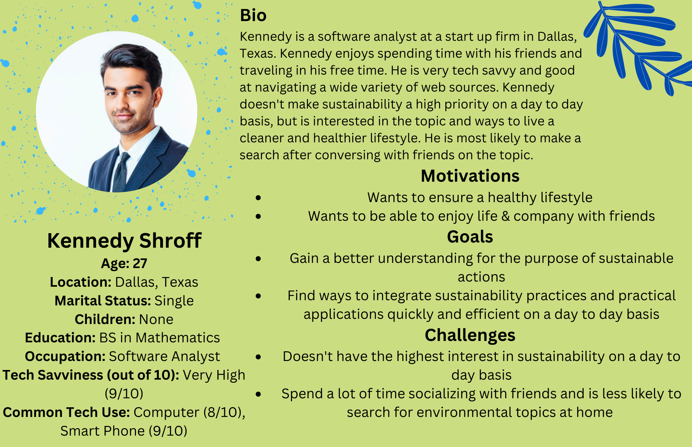

## Assignment 4: UX Storytelling

Dhruv Purohit | DH110 | Fall 2022

## Purpose of UX Storytelling
The purpose of storytelling in the UX design process is to gain a better understanding of the various scenarios target users may face and be able to empathize with their situation in a more personal and relatable way. Storytelling allows for all of the focus to go into putting ourselves in the user's shoes and to be able to put thought into the steps the user would take to achieve a desired goal or task. The storytelling process also enables the designer to think of additional ideas that make the user experience smoother or issues the user may face. From a strategic standpoint, the process allows for matching between the user's needs and product's goals/needs through a process that tests functionality, content, and structure.

## Proposed Design Features and Solutions
Through previous research and assignments, user issues were pointed out on the [UN Environment Programme](https://www.unep.org/) website. The following features are important for the design solution:
1. Consolidated top menu bar that is well organized and easy to navigate.
2. Clear identification of the tab to find information on the sustainable development goals (identifiable using words). 
3. Clear identification and list of the goals, with the user being able to quickly click on one of the colorful boxes to gain more information/detail on a specific goal. 
4. Improved newsletter sign up that does not generate errors or take information that is not satisfactory. Additionally, providing information about what the newsletter will provide the user with and how often they will receive it. 
5. A page that provides the user with simple and meaningful recommendations on changes they can make in their day to day life to have a positive impact towards achieving the sustainable goals. 

Additionally, fonts and headers needs to be made conistent (font, font size, placement) across various informational pages. The website should demonstrate consistency. 

## User Personas

  
  

## Empathy Maps

  
  

## User Scenarios and Journey Maps

### Kasey's Scenario & Journey Map (Design Features 4 & 5)
Kasey has had a long day at work. As a business operations manager at a large tech firm, she has a lot on her plate. When she arrives home from work, she then takes care of her now five year old son. Overall, Kasey stays pretty busy, but is a very detailed person and doesn’t like wasting time on the web trying to search for information. She has a big passion for sustainability and sustainable practices. Actually, she stays in touch with others of the same interest via a group chat. Kasey is worried about the future of her children being able to live a healthy and sustainable lifestyle, and the challenges that society faces if adjustments are not made to the way people treat ecosystems and earth as a whole. One night, after she put her child to sleep, someone in her environmental sustainability chat shared a link to the UN Environment Programme. With a little spare time that Kasey had, she decided to explore the site to see what it had to offer. 

Upon first opening the website, Kasey sees many pictures and what appear to be news articles. She comes to the conclusion that the site looks legitimate and trustworthy. Since she is short on time, Kasey decides to click on a tab on the top of the website that states “Your Positive Impacts.” Upon clicking the link, Kasey is redirected to a page that features many ideas for individuals to practice more sustainable actions on a day to day basis. Kasey sees that the ideas listed are appropriate for people of many ages and can be applied in a reasonable way on a daily basis. As she scrolls down the page, she discovers an area where users can interact with each other by leaving comments on what they are doing to be more sustainable. This is appealing to Kasey as she doesn’t have much interaction on this topic outside of her environmental group chat. As Kasey begins navigating away from the page, a pop-up comes up for a newsletter sign-up. Intrigued by the idea of getting sustainable action items in her inbox, Kasey clicks the “more details” button. After clicking to get more details, Kasey is presented with a page that gives details into what the newsletter provides, and if she wants to have any additional information sent to her on an ongoing basis. Upon scrolling to the bottom, Kasey sees an area to enter her personal details to ensure she receives the newsletter. She is delighted to know that she won’t have to come back to the website to get new information, but that she will get information delivered straight to her email. 

  

### Kennedy's Scenario & Journey Map (Design Features 1, 2, & 3)
Kennedy just got back from a great evening hanging out with his friends. Outside of his job, Kennedy enjoys spending time with his friends and family, and spending time outside in nature. He is really into maintaining a healthy lifestyle. Sustainability and environmental topics aren't always top of mind for Kennedy, but he has some interest in ensuring he lives in a sustainable fashion. Recently, Kennedy's friends have been bringing up the topic. This past evening, one of his friends was asking him if he’d heard about the UN’s Sustainable Development Goals. Kennedy responded “no” to his friend, however, upon returning home, he decided to do some research to learn more about these sustainability issues and goals. Kennedy is quite particular about the websites he spends time on. They must be organized and functional in order for him to engage with the content. Kennedy decides to open up his computer and search for “UN sustainable development goals.” He navigates to the search result entitled UN Environment Programme as it appears to be a reputable source. 

Upon opening the website, Kennedy is intrigued by the consistency of all the fonts and the layout of the home page. He sees numerous images and what appear to be news articles. However, as his goal is learning about the sustainable development goals, his eyes are drawn to a tab on the top consolidated menu bar that states “Sustainable Development Goals” that is also highlighted in a medium yellow/orange color. This stands out to Kennedy and he clicks. Upon clicking, he is directed to another page filled with colorful boxes. Each box appears to contain one of the sustainable development goals. Kennedy is amazed at the simplicity and functionality of the site at this point. Kennedy begins scrolling through the page, which to his surprise, is not endless. He decides to click on goal number 15, life on land, to learn more about what the goal entails and what other information is provided. Upon clicking on that particular goal, Kennedy is directed to another, well organized page that features many details on the specifics of that goal. Kennedy is drawn to the infographic at the top of the page. He continues scrolling through the page and continues to discover well written, concise, and useful information. He finally comes to a section that highlights what actions he can take on a smaller scale to make his day to day life more sustainable. After reading through this information, Kennedy scrolls to the bottom of the page, where there is an option to be redirected to the previous page with all of the goals listed. 

  

