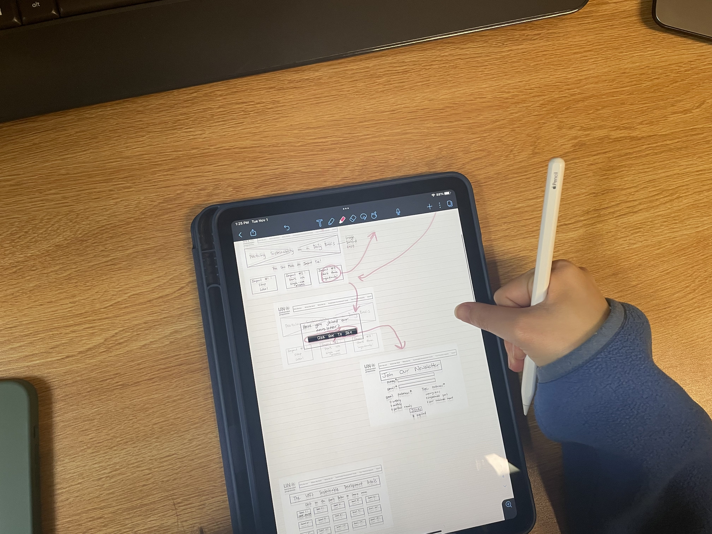

## Assignment 5: Low Fidelity Prototype

Dhruv Purohit | DH110 | Fall 2022

### Project Description
My project aims to redesign aspects of the [UN Environment Programme](https://www.unep.org/) website. In its current state, the website...

### Purpose of Low-Fidelity Prototyping
The purpose of low-fidelity prototyping is to test proposed features and changes to a website/app in a more visual manner. While the scenarios in the UX storytelling aimed to bring out frustrations and solutions the user may feel, the low-fidelity prototyping aims to bring the scenarios to life on paper. Wireframing and adding flows to the proposed changes/additions is a good way to better understand if the theoretical ideas and flows actually achieve the desired goals in an efficient manner. 

### Tasks Supported by the Prototype
My low fidelity prototype supports the following tasks: 

### Wireframes and Wireflow
add images to wireframes & flow

A link to the original wireframes and flow used for the test is linked [here](https://drive.google.com/file/d/1-sVjBUB7t0LdEpBJ19MOJOiVNGyOJX5w/view?usp=sharing).

### User Testing

  
  
  

  
  
  

A link to the wireframes and flow marked up by the user during the test is linked [here](https://drive.google.com/file/d/13IMag3i6l7X_jxVeZ39IRzsCy2On1VnU/view?usp=sharing).

### Insights, Changes, & Reflections
Paragraph reflection here.

:bulb: 

:bulb: 

:bulb: 

:bulb: 

:bulb: 

### Changes I Would Make for a Second Round of Prototype Testing
Given the insights brought up during this first round of testing, I decided to make some modifications to the wireframes and overall flow. These changes included...

The most updated wireframes and flow can be viewed [here]().
