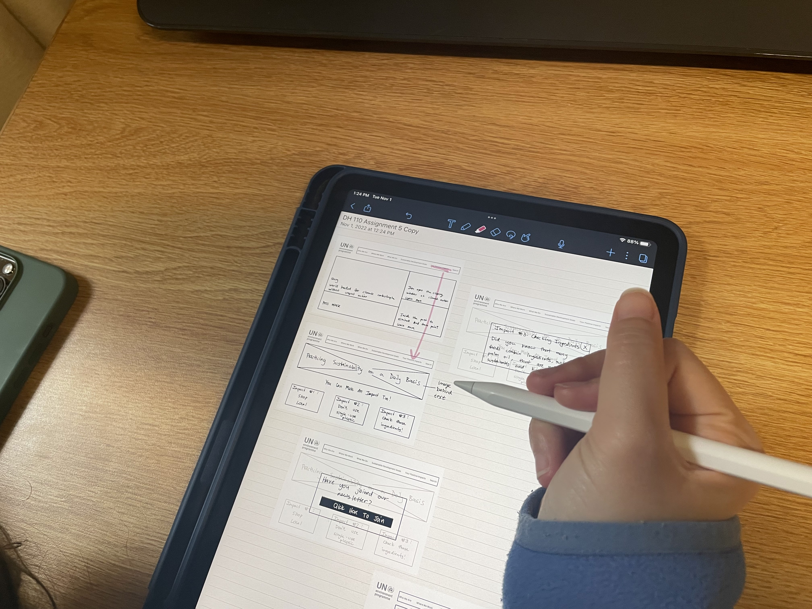
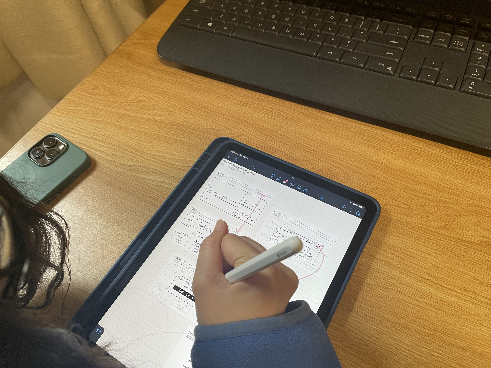

## Assignment 5: Low Fidelity Prototype

Dhruv Purohit | DH110 | Fall 2022

## Project Description
My project aims to redesign aspects of the [UN Environment Programme](https://www.unep.org/) website. In its current state, the website is slightly disorganized and does not offer the user with direct paths to find/locate certain information. Previously, through [UX storytelling exercises](https://github.com/dpurohit108/DH110-F22-DHRUVP/blob/main/Assignments/Assignment04.md), users' potential frustrations and solutions were brought to light. Through the various personas and scenarios proposed at this stage, I was able to gain insight into what it may be like to be in the user's shoes. This perspective is critical as the overall goal is to design a website that delivers information in an organized and efficient way to its users. As a means to implement the proposed design features, changes, and the issues raised in the persona scenarios, the following features are incorporated in the new design of the website: 
1. **Consolidated menu bar** Consolidating the menu navigation bar is critical to allow the user to easily navigate the website
2. **Clear identification of the tab to find information on the sustainable development goals** Since the sustainable development goals are such an important aspect to the website, the area to find more information identifiable using words and be very clear to the user.  
3. **Clear identification and list of the goals** In previous tests, the user had a hard time finding relevant information and a concise list of the goals. The user should be able to quickly click on one of the colorful boxes to gain more information/detail on a specific goal. 
4. **Improved newsletter sign up** Newsletters are an important part to keeping in touch with users that have been on the website. The newsletter inputs shuld be clear and not generate errors or take information that is not satisfactory. Additionally, providing information about what the newsletter will provide the user with and how often they will receive it. 
5. **Adding a page of practical sustainable practices** A page that provides the user with simple and meaningful recommendations on changes they can make in their day to day life to have a positive impact towards achieving the sustainable goals. 

The overall goal is to both simplify and enhance the website. Currently, there are too many clicks required in order to find information. Additionally, there are many inconsistencies in simple design aspects throughout the site. This low-fidelity prototype aims to give an initial trial at how these elements are implemented on paper (through the wireframe) and how a test user navigates the changes/improvements. The user-research process is critical as it allows the creator/designer to see if what they are designing works for the common person who may not be so familiar with the site. Performing this process throughout the design process allows the designer to go back and make modifications based on what worked well and what didn't. 

## Purpose of Low-Fidelity Prototyping
The purpose of low-fidelity prototyping is to test proposed features and changes to a website/app in a more visual manner. While the scenarios in the UX storytelling aimed to bring out frustrations and solutions the user may feel, the low-fidelity prototyping aims to bring the scenarios to life on paper (or iPad in this case). Wireframing and adding flows to the proposed changes/additions is a good way to better understand if the theoretical ideas and flows actually achieve the desired goals in an efficient and effective manner. 

The designs were drawn out on my iPad using the notability app. As this is an initial phase of wireframing (low-fidelity), all color and design details were not necessary. The goal was to implement the basics of the improvements that I wanted to make. The background page with the revised menu bar was made on [Canva](canva.com).

## Tasks Supported by the Prototype
My low fidelity prototype supports the following tasks (most of which are outlined in greater detail above): 
1. Being able to quickly locate and find information on the sustainable development goals
2. Having easy access to details on every goal once on the main page for the sustainable goals
3. Having a good pop-up and dedicated space for users to sign up for a newsletter
4. Allowing the user to easily find practical tips on how to make more sustainable decisions on a day-to-day basis

The improved design also features:
1. A new menu/navigation bar that better tells the user where they can find important information
2. Improved placement of the search bar
3. Identifiable ways for users to go back **and** exit certain windows/pages
4. Shorter, more interactive pages rather than the existing pages where scrolling is endless

## Wireframes and Wireflow
A link to the original wireframes and wireflow used for the test is linked [here](https://drive.google.com/file/d/1-sVjBUB7t0LdEpBJ19MOJOiVNGyOJX5w/view?usp=sharing).

  
  

## User Testing

  
  
  

  
  
  

A link to the wireframes and wireflow marked up by the user during the test is linked [here](https://drive.google.com/file/d/13IMag3i6l7X_jxVeZ39IRzsCy2On1VnU/view?usp=sharing).

## Insights, Changes, & Reflections
The user testing was once again a very effective way to see if the proposed changes work for users. Being able to see the initial changes on the wireflows was helpful and insightful as well. 

:bulb: 

:bulb: 

:bulb: 

:bulb: 

:bulb: 

## Further Changes & Revisions
Given the insights brought up during this first round of testing, I decided to make some modifications to the wireframes and overall flow. These changes included...

The most updated wireframes and flow can be viewed [here]().
