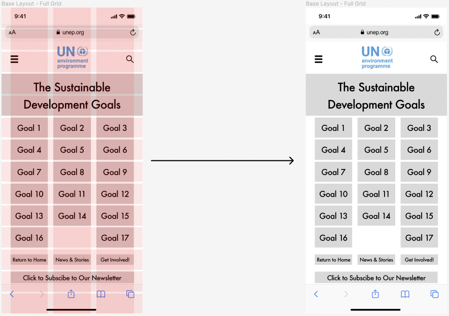
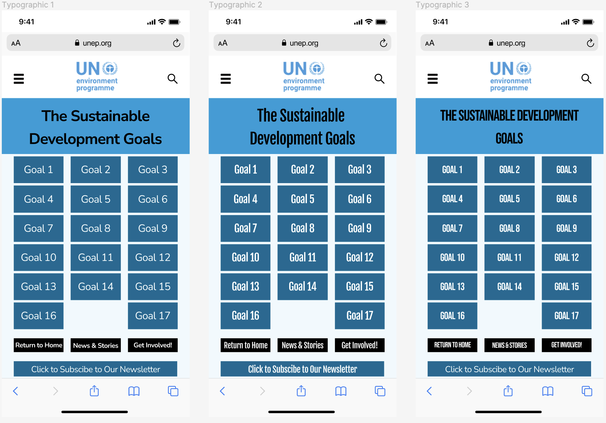
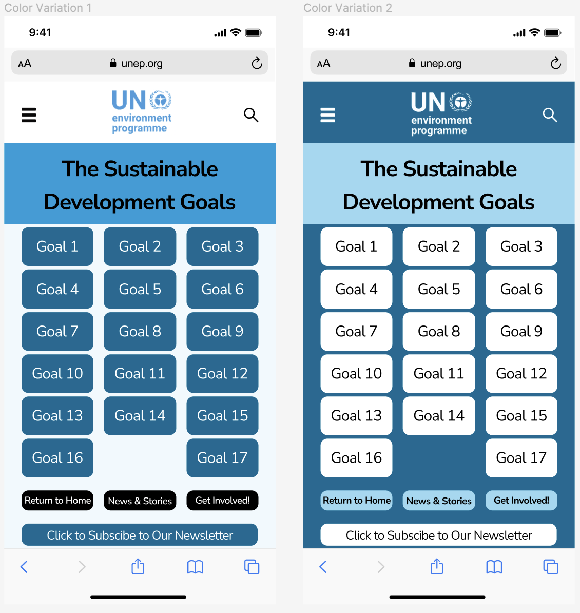

# Assignment 06: Interface Design

Dhruv Purohit | DH110 | Fall 2022

## Project Description

The goal of this project is to redesign the current [UN Environment Programme](https://www.unep.org) website to make it more accessible for the ideal and most common user.  

* The digitized version of the wireframe/wireflow designed in [Assignment 5](https://github.com/dpurohit108/DH110-F22-DHRUVP/blob/main/Assignments/Assignment05.md) can be found [here]().

* The screen designs designed on [Figma](https://www.figma.com/) can be found [here](https://www.figma.com/file/HlX4ncn8STQ01Od3mUnfZv/A6%3A-Interface-Design?node-id=0%3A1).

## Screen Design

### Grid Layout

  

### Typographic Variations

  

### Shape Variations

  

### Color Variations (Light vs. Dark Mode)

  

## Impression Test
The user I used for the impression test preferred that I use their direct quatations. As they viewed my screen designs, I took note of the comments that made. I asked the user

## Accessibility Check

  
  
  
  

## Revisions

## Design System Summary
