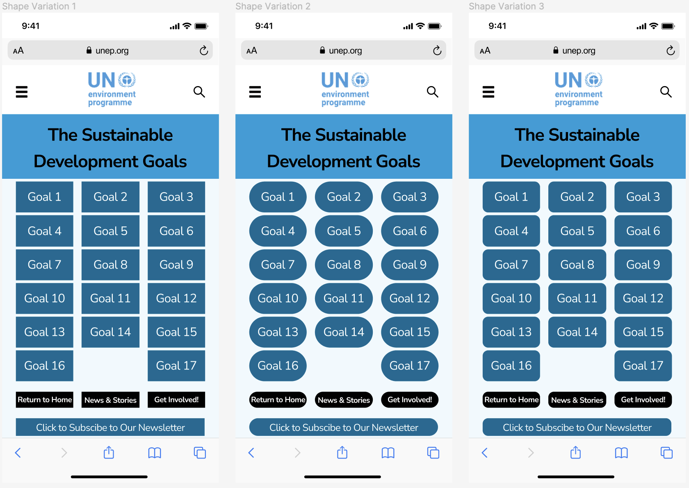
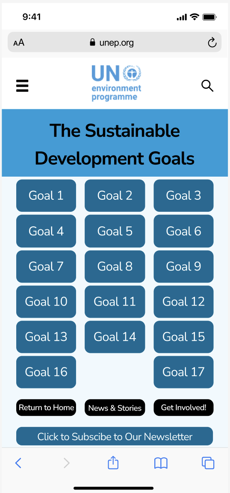
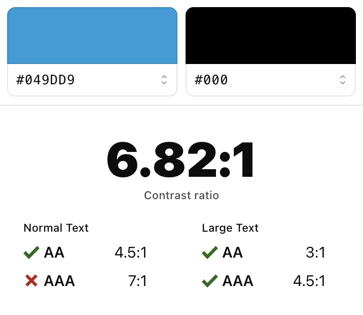
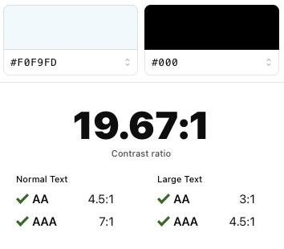

# Assignment 06: Interface Design

Dhruv Purohit | DH110 | Fall 2022

## Project Description

The goal of this project is to redesign the current [UN Environment Programme](https://www.unep.org) website to make it more accessible for the ideal and most common user. In doing so, the aim is to make it easier for the user to find relevant information on sustainability in a quick and efficient manner. Currently, the site is difficult to navigate and disorganized. Additionally, information on the UN’s Sustainable Development Goals is difficult to locate with a few clicks. Therefore, one of the main goals is to make it easy for the user to find information on these goals and what they are. 

The interface design process for this website includes the following process: 

1. Grid Design & Layout (aligning all items with a grid)
2. Typographic Design & Variations (designing & varying the text fonts)
3. Shape Design & Variations (designing & varying the shape of boxes/buttons)
4. Color Design & Variations (designing & varying the color options, specifically a light and dark mode)
5. Accessibility CHeck (check on color contrast)
6. User Impression Testing
7. Revisions from user feedback
8. Final Interface Design

The purpose of the interface design process is to iterate through various design elements that the user may see on a specific website or app, particularly from an aesthetic and functional view. Interface design focuses on anticipating what the user needs and will do as they navigate the website/app. The goal of this process is to design an interface that is (1) appealing to the user, (2) easy to navigate, and (3) engages the user in an effective and efficient way. 

### Wireframe Layout Choice 

  

* **The digitized version of the wireframe/wireflow designed in [Assignment 5](https://github.com/dpurohit108/DH110-F22-DHRUVP/blob/main/Assignments/Assignment05.md) can be found [here](https://www.figma.com/file/AZGK2xOzvmFMts9cegN1mN/Digitized-Wireflow?node-id=0%3A1).**

* **The screen designs designed on [Figma](https://www.figma.com/) can be found [here](https://www.figma.com/file/HlX4ncn8STQ01Od3mUnfZv/A6%3A-Interface-Design?node-id=0%3A1).**

## Screen Design

### Grid Layout ----> Base Layout

  

### Typographic Variations

  

### Shape Variations

  

### Color Variations (Light vs. Dark Mode)

  

### Current Design Choice

  

## Impression Test
The user I used for the impression test preferred that I use their direct quotations as part of the summary. As they viewed my screen designs, I took note of the comments that were made (both positive and negative). I asked the user to give their impression of the current design choice (above). Following their initial, quick impression of my design, I asked them some further questions about the design to ensure that they were able to tell me things they liked and disliked.

User quotes: 

* "The color choice is dynamic and catches my eye"
* "Adding some sort of symbol next to the newsletter sign-up would be nice"
* "The design is very symmetrical"
* "The page is filled with blue buttons, however, the black buttons stand out"
* "It would be helpful to have some context to the page. A small bit of text at the beginning would be ideal"

Overall, the user found my interface design pretty good and liked the design choices I made. The user noted the consistency and symmetry, both items that I prioritized in the design. They recognized the black buttons at the bottom, which were designed to stand out on purpose. In the case the user accidentally reached this page, they had options to return to the home page. The user also mentioned adding an arrow or indicator on each goal button that clearly indicates that it is clickable. This may be difficult as it will mess with the alignment, however, when doing revisions, it will be considered. The user pointed out that it would be more helpful to have some additional context to the page. I agree with this, especially as this is a design aspect that is needed on additional pages as well. As I do revisions, this will be the biggest thing to keep in mind with the interface design. Having some space for context/summary/instructions on any page is critical, and I'm glad the user was able to identify this. 

## Accessibility Check
A color contrast accessibility test was run on the various color contrasts on the interface design using the [Spark](https://www.getstark.co/) plugin. The results on the various contrasts can be seen in the screenshots below. 

  
  
  
  

All of the color contrasts passed the WCAG 2.0 AA level. Three of the four tests did not pass the AAA level, however, since all the text falls into the "large text" category and since we are primarily concerned with the AA test, I came to the conclusion that the chosen colors were accessible. 

## Revisions
Following the comments from the impression test, the following revisions were made to the [current design choice](https://github.com/dpurohit108/DH110-F22-DHRUVP/blob/main/Assignments/Assignment06.md#current-design-choice) that I had previously selected.

* Revision 1: Added clicking indicator on each button. This does not look good as the text is no longer centered and looks disorganized. 
* Revision 2: Added icon next to newsletter sign up button. This works well. 
* Revision 3: Includes Revision 2 & context under the title. This required some adjustment to the title, but worked out well. This will be a good design feature on additional pages as well. 

  

## Final Design
The following is the final interface design. This design incorporates all of my design ideas and two revisions added from the user's impression test. Additional information on the design decisions can be found below under the design system summary. 

  

## Design System Summary

### Graphic Design Summary
**Typeface Family: Nunito Sans**
* Header: Bold, Size 32
* Body: Regular, Size 16
* Goal Button Labels: Size 22
* Navigation Button Labels: Bold, Size 14
* Newsletter Button Label: Size 18

### Color Scheme

  

The colors extracted from the logo using Adobe were used, in addition to a couple of other colors in order to add variation and to pass color contrast tests. The colors chosen match the general scheme, however, the Spark color contrast required some colors to be darkened/lightened. Per the assignment instructions, these colors were modified and used accordingly. 

* Header: 049DD9
* Goal Buttons: 006A94
* Navigation Button Labels: 000000
* Newsletter Button Label: 006A94
* Background: F0F9FD

### Layout Grid
* 14 rows (0 margin, 5 gutter)
* 3 columns (25 margin, 15 gutter)

### Graphical Interface Design

#### Typographic Design
For the typographic design, I chose Nunito Sans. I chose this font as it appeared professional, yet welcoming. When creating the design options, I compared Nunito Sans, Fjalla One, and Bebas Neue. Fjalla One was a little too informal and the text was too thick. Bebas Neue was an all-caps font, which did not go well with the other aspects on the page/site. Therefore, I went for Nunito Sans, the font that was simple, yet welcoming and professional. To make the heading stand out, it was bolded. Additioanly, the navigation buttons (black buttons) were also bolded. 

#### Shape Design
The goal with shape design was to have a square option, round option, and in-between (in between square and round) option. Overall, when choosing the best shape, the goal was choosing what would make the page feel warm and welcoming to the user. In this case, the square and fully circular (corner radius = 40) were both extremes. The in-between option (corner radius = 10) looked to be the best fit. It wasn't as cut edge as the square, yet not as rounded as the circle. Visually, it also fulfilled my goal of making the site inviting.  

#### Color Design
The color design was pretty straightforward as my goal was to stay within the current colors already within the logo. However, due to the page layout and in order to meet color contrast checks, additional colors were added. These colors, however, were not random. They were in line with the existing palette, and were mostly lighter or darker versions of other colors already present. When it came to choosing light mode vs. dark mode, I chose light as the dark mode was color overload. Having the dark turquoise at the top of the page and as a background did not suit the design well. 

#### Overall Design
Overall, I aimed to go for a simplistic, clean, and organized design. I feel like this goal was well achieved in the final design. Being able to incorporate the user feedback and make revisions was great as well. Since the focus of this whole process is the user, being able to get the feedback and implement it improved the interface design. The final design is inviting and warm for the user. It features many options for user interactions, and provides the user with a way to navigate to other parts of the site. The colors stand out and make the site look professional and legitimate as well. All of these elements combine to create an new and effective interface design for the UN Environment Programme Website. 
