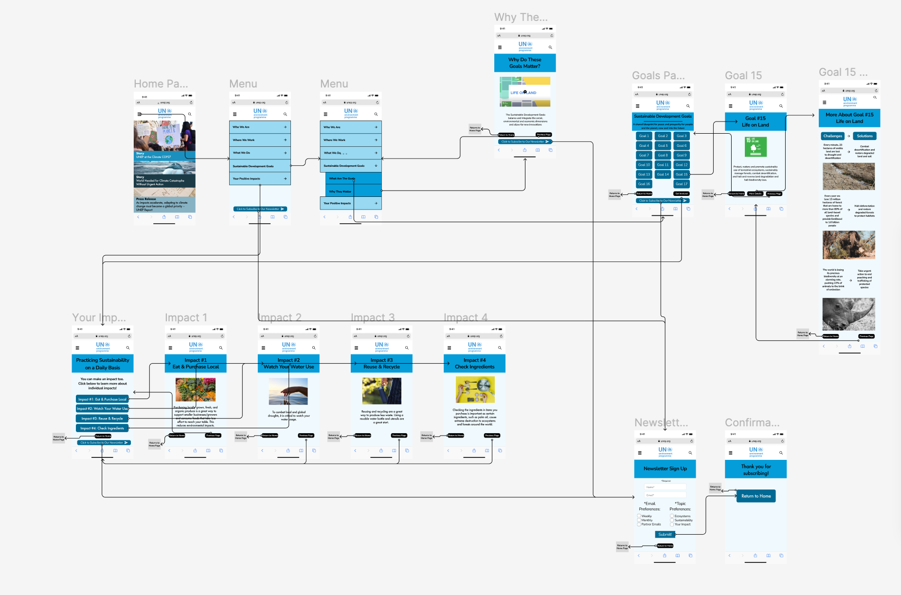

# Assignment 07: High Fidelity Prototype

Dhruv Purohit | DH110 | Fall 2022

## Project Description
The goal of this project is to redesign the current [UN Environment Programme](https://www.unep.org) website to make it more accessible. The tasks (outlined below) are the main objective of the interactive prototype. The proposed improvements are all included within these tasks and the prototype. 

The purpose of the interactive prototype phase is to implement the interface design and wireflow together to create a functioning model of the proposed website. The interactive prototype brings to life the changes that have been in writing and testing for the last many assignments. By getting feedback on this realistic model of the website, further improvements can be made to make the user experience as seamless as possible. The process for creating this prototype has come from work in previous assignments relating to interface design and wireflow. Following the prototype creation, feedback will be collected from users.

## Tasks
The following tasks are supported by this interactive prototype: 
1. Find the list of all the sustainable development goals and find more details on **goal 15** and the goal's challenges & solutions.
2. Find information on practical tips that the user can implement to have a positive impact towards the goals, specifically related to goal 15.
3. Extra: Subsribing to the newsletter to enable the user to stay engaged with the resources of the website. 

## Updated Wireframes with Graphic Design

  

The updated wireframes/wireflow can be found [here](https://www.figma.com/file/70jzqqbnqGPVP5KZgTsiL1/Updated-Flow?node-id=0%3A1&t=hHNvR5jRHP892VcB-1).

## Interactive Prototype

The full interactive prototype can be found [here](https://www.figma.com/proto/8pJf6XjZfpIPxfYtA0DmpO/High-Fidelity?page-id=0%3A1&node-id=1%3A101&viewport=563%2C644%2C0.25&scaling=min-zoom&starting-point-node-id=1%3A101).

## Cognitive Walkthrough (Updated following in class cognitive walkthrough)

The following were generalized comments & quotes made by two fellow DH110 students during an in class cognitive walk through on Wednesday, November 16th.
The comments and notes recorded using Google Forms can be found [here](https://docs.google.com/document/d/1Kxph_524VaKWZBmiZiLl0LsLY00k5Ua1Gwj5ecwKFnw/edit).

* "Maybe hamburger menu should be accessible from all pages"
* "Ensure that logo on the top links back to home on all instances"
* "A little confusing why they are all different colors? perhaps all stories can be one kind of blue and the press release can be another shade of blue"
* "I think back buttons would be helpful rather than just going to home"
* "Provide a little more information that your newsletter can show?"
* "Sorry I see there is a back button, this is somewhat unintuitive though"
* "Return to home button does not seem super necessary? at least not on every page because maybe just make the logo a return to home button"
* In reference to Goal 15 Details Page: "These kind of look like buttons that I can click, so it is deceiving that it is not" and "center alignment is a little hard to read, would left align it"
* "The interface does look clean"
* The purpose of the website is clear and the user is able to make progress.
* Some improvements can be made to make the navigation a bit easier.

The feedback summary can be found below.

## Feedback Summary & Revisions (Updated following in class cognitive walkthrough)

The cognitive walkthrough process went smoothly, and both participants agreed that it went smoothly for the most part. Both users made comments both on the interactive prototype and on the google form. The feedback I received mostly pertained to ways that I could improve the site's navigation. The users pointed out ways for me to make the back buttons more effective, in addition to ensuring that users can have easy access to the site menu from more pages. Currently all of my return to home/previous page buttons are written with text and not necessarily in the best locations. The users suggested that I utilize icons and move the buttons on certain pages. This being my first time, I didn't think I would get so much good feedback that would really improve the navigation and usability of my site. While the users were able to complete all the tasks successfully, they noted/suggested some changes and issues that they ran into when navigating the site. I found this process very effective and a great way to test how successful the design is. I have noted numerous suggestions above (under cognitive walkthrough) and in this paragraph. In order to make best use of the comments and suggestions offered by the users, a list of the changes I made as a result of their comments can be found below along with a revised prototype featuring those changes. 

The revised prototype can be found [here](https://www.figma.com/proto/Clu9FojG6FHp8pglP3ZQbl/High-Fidelity-(V2)?page-id=0%3A1&node-id=1%3A101&viewport=599%2C656%2C0.26&scaling=scale-down&starting-point-node-id=1%3A101) and includes the follolwing improvements, most of which were suggested by the users: 

1. Changed colors of news articles/press releases to be consistent rather than different shades of blue.
2. Ensured that the logo at the top of the page consistentily linked back to the home page. 
3. On the menu page, allow the user to return to the original menu when they click the up arrow on the sustainable developemnt goals menu page. 
4. Ensure that the hamburger menu bar is accessible from additional pages. 
5. Redesign certain buttons to make them more intuitive and prominent. 
6. Modified text on Goal 15 Details page to be left justified.
7. Modified text headers on Goal 15 Details page to not look like buttons.
8. add
9. add
10. add
11. add
12. While the users said to maybe add icons instead of saying "Return to Home" I found that this was not the best idea as it made the button look less prominenet and assumes that all users know that clicking a home icon will return them to the original home page. 
