# [Gaining Easier Access to Sustainability Issues and Solutions: UN Environment Programme Website Redesign](https://dpurohit108.github.io/DH110-F22-DHRUVP/)

By: Dhruv Purohit, Digital Humanities 110 - Fall 2022

## About the Project
The goal of this project is to redesign the current [UN Environment Programme](https://www.unep.org) website to make it more accessible. In doing so, the aim is to make it easier for the user to find relevant information on sustainability in a quick and efficient manner. Currently, the site is difficult to navigate and disorganized. Additionally, information on the UN’s Sustainable Development Goals is difficult to locate with a few clicks. Therefore, one of the main goals is to make it easy for the user to find information on these goals and what they are. The website was evaluated and design changes and decisions were made over the course of 7 assignments in an 8 week period. These assignments highlighted the following of analysis and design: 
* Competitor Analysis (Heuristic Analysis & Usability Testing)
* User Research (Contextual Inquiry)
* UX Storytelling
* Wireframes & Wireflow
* Low-Fidelity Prototype
* User Interface Design
* High-Fidelity Prototype

## Design Statement

## Competitor Analysis

### Heuristic Evaluation

The first step in this project was to choose two websites that fit the theme of the project (UN Sustainable Development Goal 15) and analyze various parts of the site to see is they passed Jacob Nielsen's [10 Usability Heuristics](https://www.nngroup.com/articles/ten-usability-heuristics/). For my analysis, I chose the [UN Environment Programme](https://www.unep.org/explore-topics/sustainable-development-goals/why-do-sustainable-development-goals-matter/goal-15) website and the [SDG Tracker](https://sdg-tracker.org/biodiversity) website. Each of the ten heuristics were analyzed with respect to the websites and given a severity rating. 

  

With the [UN Environment Programme](https://www.unep.org) website (the website chosen for re-design), there were **minor usability problems** (fixes that require low priority) in the following categories: 

1. Visibility of System Status
2. Error Prevention
3. Recognition Rather Than Recall

and **major usability problem** (critical fixes that need high priority) in the following categories: 

1. Match Between System and the Real World
2. Consistency and Standards 
3. Flexibility and Efficiency of Use
4. Aesthetic and Minimalist Design
5. Help Users Recognize, Diagnose, and Recover From Errors
6. Help and Documentation

Overall, the website looked functional at first look, however, when analyzing the 10 heuristics, numerous issues were found, including the overall organization of the website.

Further details on the heristic evluation can be found [here](https://github.com/dpurohit108/DH110-F22-DHRUVP/blob/main/Assignments/Assignment01.md).

### Usability Testing

Following the heuristic analysis and identification of issues on the website, usability testing was used to gain insight from an ideal user to see how they would react to certain tasks and navigate the website. This process was conducted in person, and recorded using zoom, in order to capture the screen and the facial expressions of the subject. For this test, a detailed [questionnaire](https://forms.gle/aDQhmGhYESiUeESB6) was created that would guide the user through background questions, pre-test questions, and four tasks (listed below). The tasks were centered around issues I noted through the heuristic analysis.

Task 1: Suppose you want to learn about the sustainable development goals and the progress being made to achieve them. Could you try these tasks?
* Navigate to the page on sustainable development goals
* Locate the colorful boxes that are associated with the goals
* Click on one of the goals to view more details
* Locate the page on measuring progress on the goals

Task 2: Suppose you work for a fossil fuel company and are trying to find out more information on what the UN Environment Programme highlights about chemical pollutants. Could you try these tasks?
* Navigate to the page on chemicals and pollution action
* Find information on the benefits of chemical control
* Find the main contributors to chemical pollution around the world

Task 3: Suppose you are a researcher and want to obtain details on publications and studies. Could you try these tasks?
* Navigate to the page on publications & data
* Navigate to the "see more" under publications
* Find publications on the topic of sustainable goals

Task 4: Suppose you want to sign up for the newsletter. 
* Navigate to the page to sign up for the newsletter

The full usabiltiy test can be found below. 

<iframe width="640" height="360" src="https://www.youtube.com/embed/8J-7qhC3U3M" title="110 Recording" frameborder="0" allow="accelerometer; autoplay; clipboard-write; encrypted-media; gyroscope; picture-in-picture" allowfullscreen></iframe>

It was found that the issues that I had raised from the heuristic analysis were issues that the user faced while performing the usability testing. While the user was successful at completing a majority of the tasks (and subtasks) listed above, the user pointed out that the **most likely task** they would complete was **the most difficult and time consuming**. The user was frustrated and somewhat lost at numerous points throughout the testing process, and brought up specific issues pertaining to: 

* the search bar not working
* menu bar not being fully functional
* the lack of consnsistency
* overll poor design

Additional details on the usability testing can be found [here](https://github.com/dpurohit108/DH110-F22-DHRUVP/blob/main/Assignments/Assignment02.md).

## User Research - Contextual Inquiry

The user research part of this project involved a contextual inquiry. The contextual inquiry differed from the usability test in that it provided the test user with more general guidelines (rather than very specific tasks) to see how they navigated the website. The goal of the inquiry was to observe how the user interacted with the website in a more natural setting. In order to facilitate a smooth process with the user, I prepared [this contextual inquiry guide](https://docs.google.com/document/d/1_hTVyhpJece9Vag8-CkiOGD3xA3O7QO6d4-hGxfVV98/edit). This document highlighted all the activities that were to be completed by the user and included the following: 

1. Introductory/Background Questions: Asked to get a good understanding of the user's background and context with the topic.
2. Observations During Activities: Used to observe the user in their natural web search setting and to document findings.
3. Follow-up and Closing Questions: Ask the user about how they felt after the activities and get final thoughts.

The live audio of the contextual inquiry can be seen [here](https://otter.ai/u/aQG3mYb4LGc0YGww5LUdvX6DMto) in addition to the [transcript](https://docs.google.com/document/d/1pvMEFMXPk14b4ZPewLB4gMEG761O3jPGm6tfoEgZTPU/edit?usp=sharing) and [field notes](https://docs.google.com/document/d/18ZU6pHUanSxlVs3BWZ0hgp5_mV55YhYwhWyC_Xa9kd0/edit?usp=sharing).

This research aspect provided me with additional detail as to what to look for in an ideal site and how to improve the redesign. The process went well and the items that stood out to me the most were the following: 
1. How the user viewed the presentation of information on the site
2. The vast amount of information that the user found interesting
3. How quickly the user was willing to integrate a change/alternative into their life 

The user expressed that having a successful visit to the site depended on the clarity and simplicity of the information they read/received. At times, this process was challenging as it depended on the user speaking their mind while being guided through the inquiry, however, overall it went well and provided me with further insight on how to redesign the website.

Further details on the user research/contextual inquiry process can be found [here](https://github.com/dpurohit108/DH110-F22-DHRUVP/blob/main/Assignments/Assignment03.md).

## UX Storytelling

The purpose of the UX storytelling process is to gain better insight into various scenarios that users may experience with the website. This process allows for the designer (me) to be in the user's shoes and get a better feel for some of the challenges they may experience. Based off ot the previous three parts of the project (heuristic evaluation, usability testing, and user research), the following five design solutions/features were tested as part of the storytelling process: 

1. Consolidated top menu bar that is well organized and easy to navigate.
2. Clear identification of the tab to find information on the sustainable development goals (identifiable using words).
3. Clear identification and list of the goals, with the user being able to quickly click on one of the colorful boxes to gain more information/detail on a specific goal.
4. Improved newsletter sign up that does not generate errors or take information that is not satisfactory. Additionally, providing information about what the newsletter will provide the user with and how often they will receive it.
5. A page that provides the user with simple and meaningful recommendations on changes they can make in their day to day life to have a positive impact towards achieving the sustainable goals.

Note: These generalized tasks/design solutions/features were re-defined in a more actionable way during the prototyping process. 

User personas and empathy maps (below) were created to get a better understanding of the user's background, thoughts, and actions. The two users created were **Kasey and Kennedy**. Their details can be viewed below. Additionally two different scenarios were written (one for each user) that highlighted their interactions with the website, background to why they are searching for certain information, and how they interact with the website. Kasey's scenario can be viewed [here](https://github.com/dpurohit108/DH110-F22-DHRUVP/blob/main/Assignments/Assignment04.md#kaseys-scenario--journey-map-design-features-4--5) and Kennedy's scenario can be viewed [here](https://github.com/dpurohit108/DH110-F22-DHRUVP/blob/main/Assignments/Assignment04.md#kennedys-scenario--journey-map-design-features-1-2--3). Journey maps were also created for each user to highlight their process (initiation, frustration, solution, and goal) and journey through the website. The journey maps can be viewed below.

### User Personas

  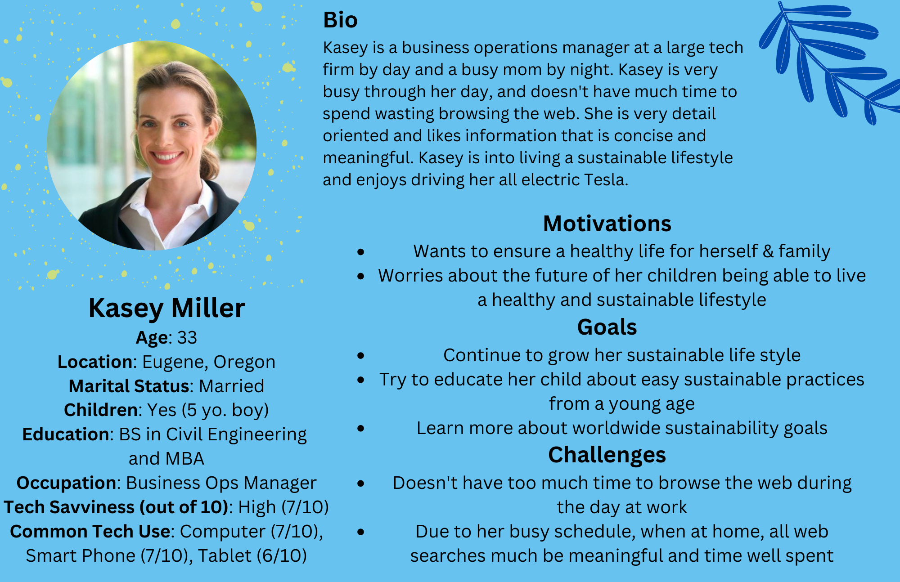
  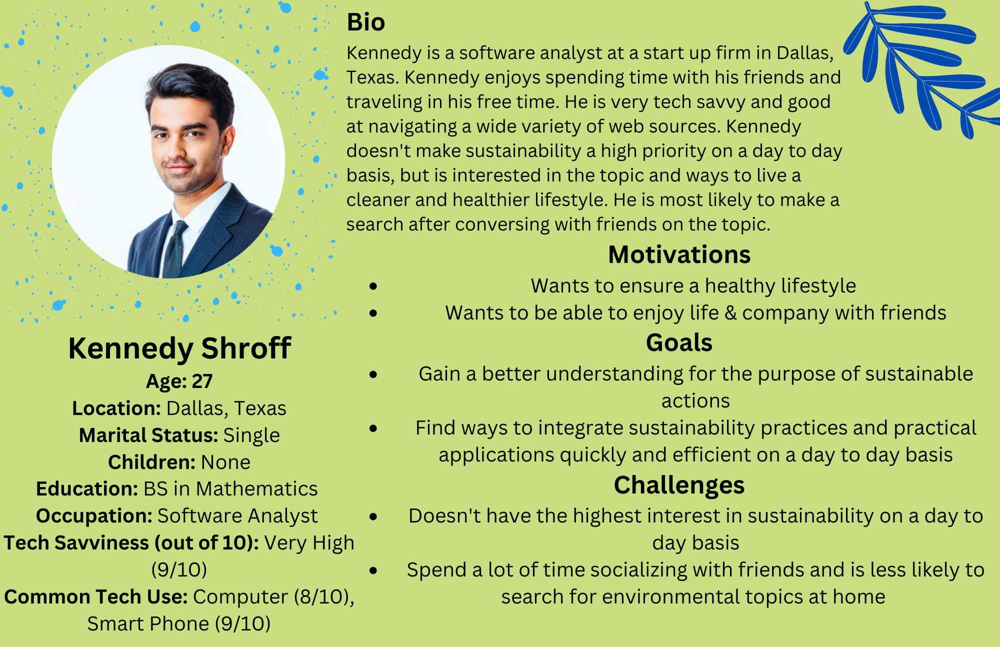

### Empathy Maps

  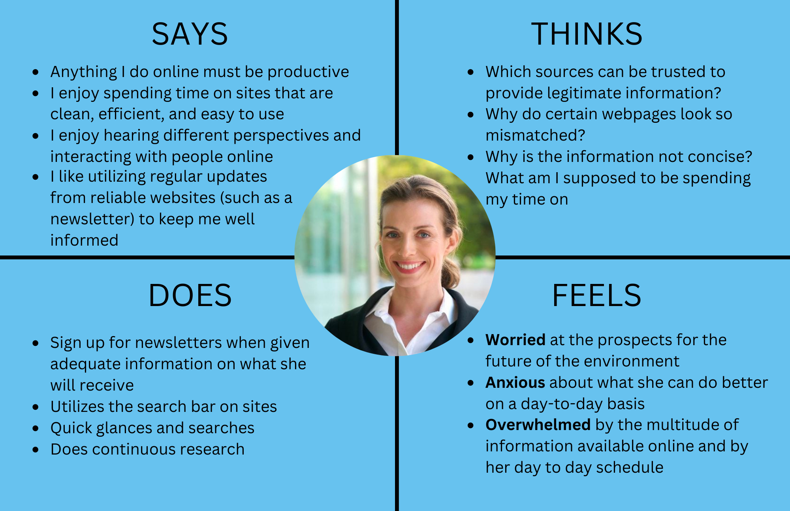
  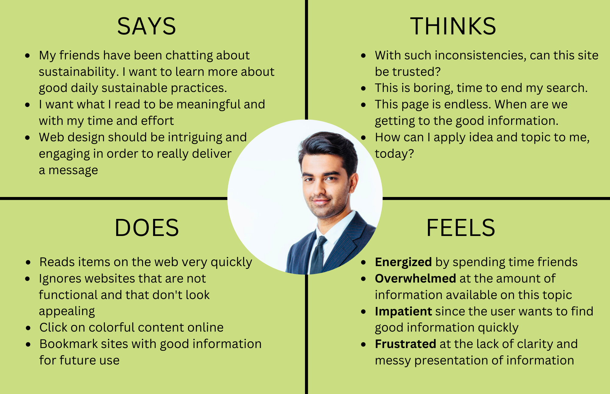

### Journey Maps

  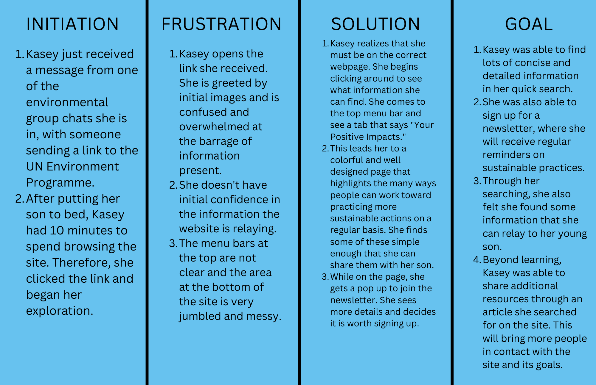
  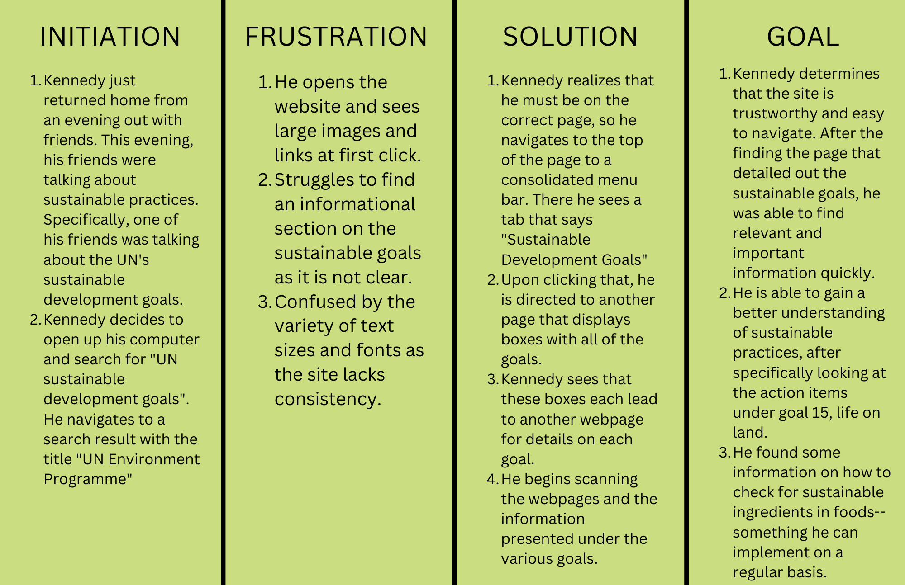

Further details on the UX storytelling process and scenarios can be found [here](https://github.com/dpurohit108/DH110-F22-DHRUVP/blob/main/Assignments/Assignment04.md).

## Initial Wireframes & Wireflow

  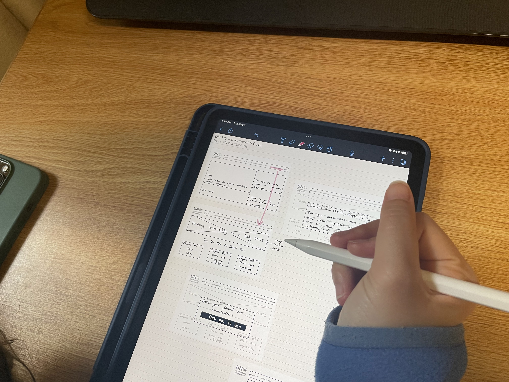
  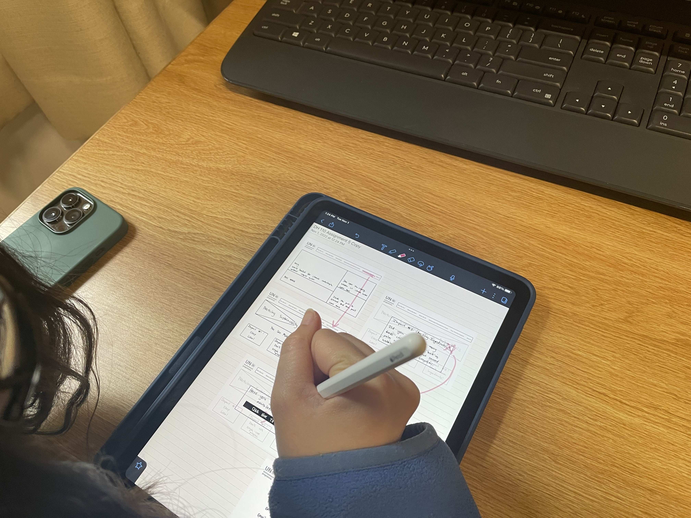
  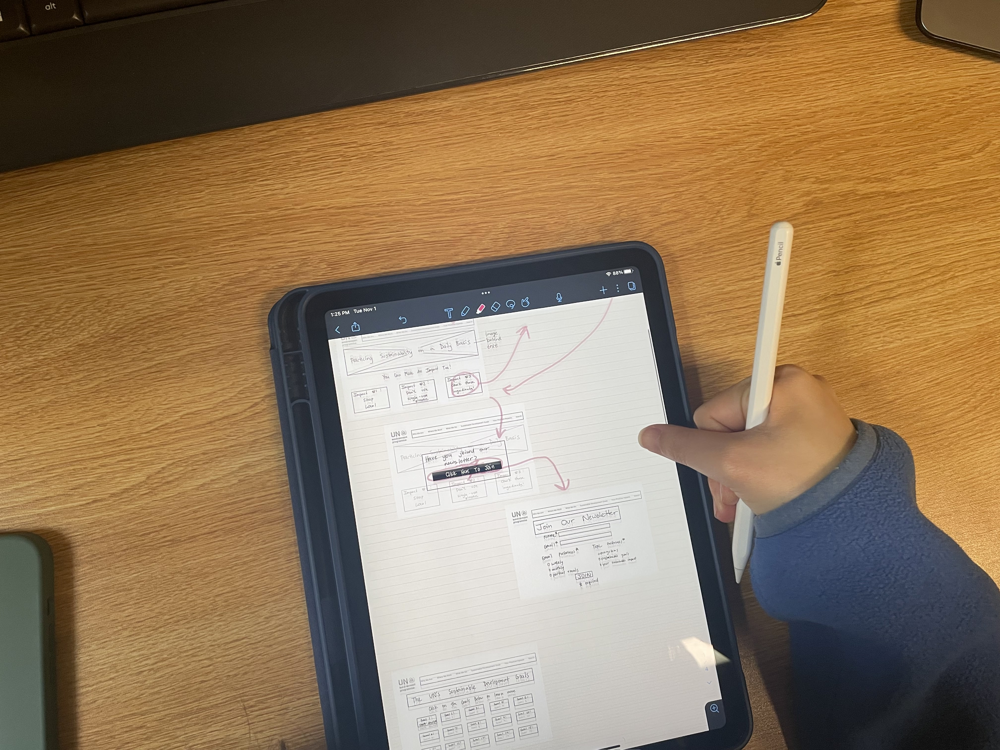

  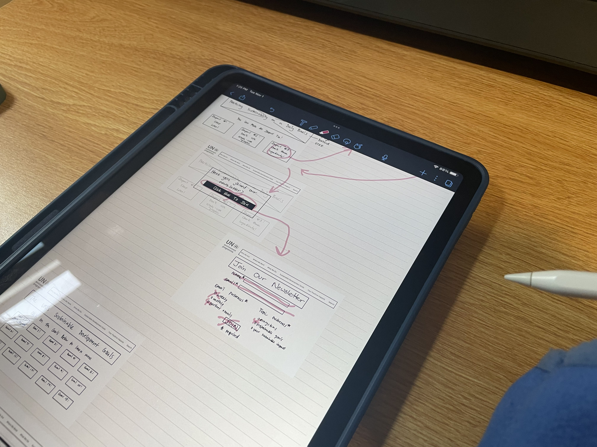
  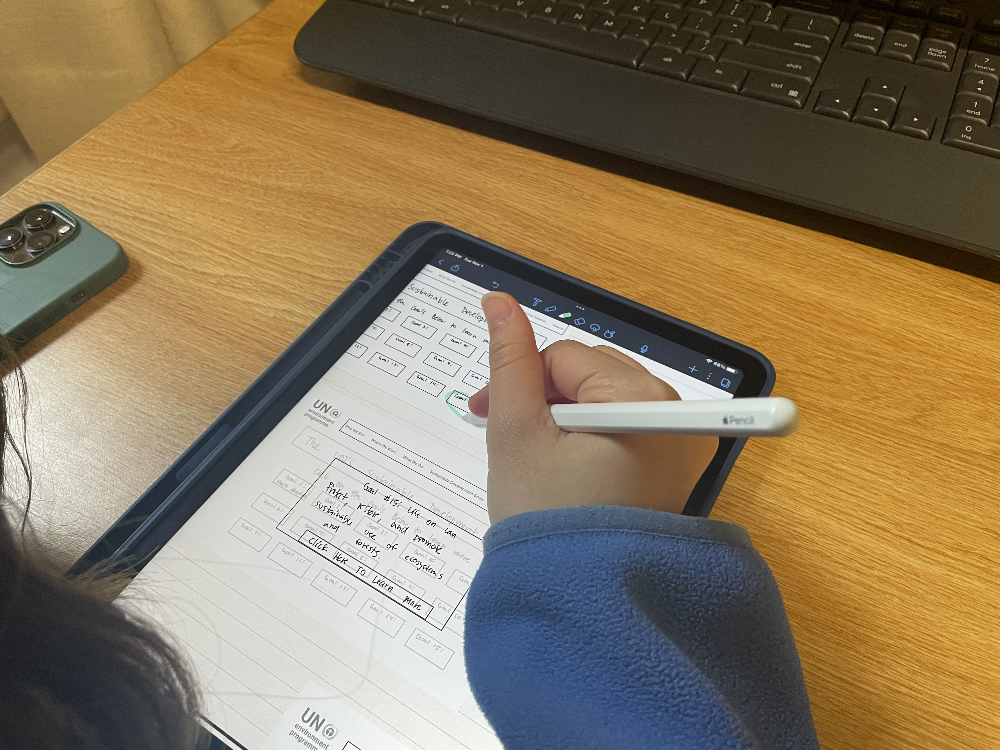
  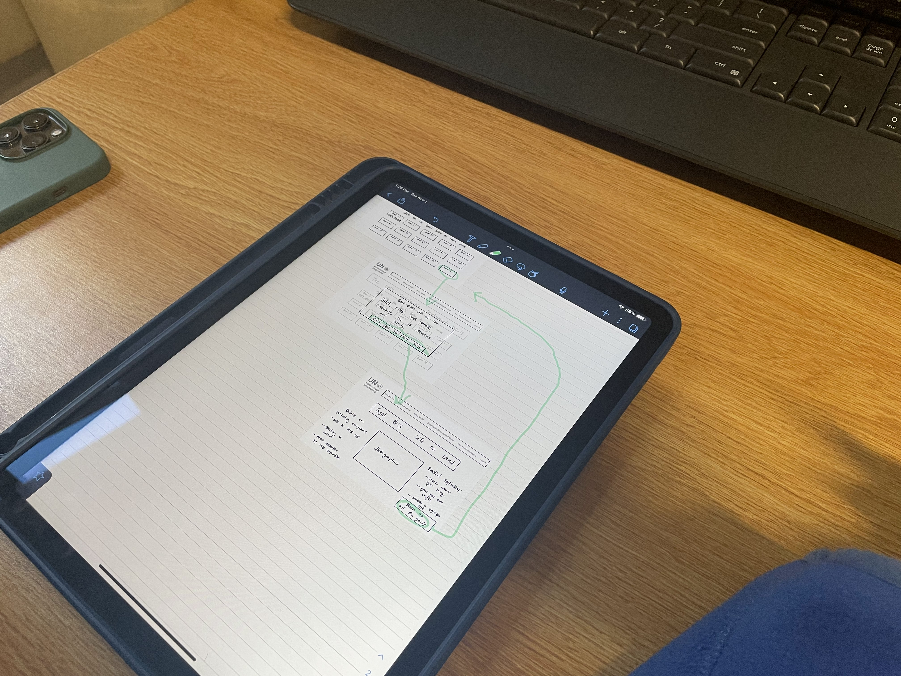

A link to the wireframes and wireflow marked up by the user during the test can be found [here](https://drive.google.com/file/d/13IMag3i6l7X_jxVeZ39IRzsCy2On1VnU/view?usp=sharing).

Further details on the wireframes can be found [here](https://github.com/dpurohit108/DH110-F22-DHRUVP/blob/main/Assignments/Assignment05.md).

## Low-Fidelity Prototype & Digitized Flow

The initial digitized wireflow can be found below. 

<iframe style="border: 1px solid rgba(0, 0, 0, 0.1);" width="800" height="450" src="https://www.figma.com/embed?embed_host=share&url=https%3A%2F%2Fwww.figma.com%2Ffile%2FAZGK2xOzvmFMts9cegN1mN%2FDigitized-Wireflow%3Fnode-id%3D0%253A1%26t%3Dv7UoJClQfxIDmy1K-1" allowfullscreen></iframe>

Further details on the low-fidelity prototype can be found [here](https://github.com/dpurohit108/DH110-F22-DHRUVP/blob/main/Assignments/Assignment05.md) and further details on the digitized flow can be found [here](https://github.com/dpurohit108/DH110-F22-DHRUVP/blob/main/Assignments/Assignment06.md)

## User Interface Design

The interace design can be found below: 

<iframe style="border: 1px solid rgba(0, 0, 0, 0.1);" width="800" height="450" src="https://www.figma.com/embed?embed_host=share&url=https%3A%2F%2Fwww.figma.com%2Ffile%2FHlX4ncn8STQ01Od3mUnfZv%2FA6%253A-Interface-Design%3Fnode-id%3D0%253A1%26t%3DroNDWpXDMUy8XsqF-1" allowfullscreen></iframe>

Additional details on the user interface design process can be found [here](https://github.com/dpurohit108/DH110-F22-DHRUVP/blob/main/Assignments/Assignment06.md). 

## High-Fidelity Prototype

The high fidelity prototype can be found below.

<iframe style="border: 1px solid rgba(0, 0, 0, 0.1);" width="800" height="450" src="https://www.figma.com/embed?embed_host=share&url=https%3A%2F%2Fwww.figma.com%2Fproto%2F8pJf6XjZfpIPxfYtA0DmpO%2FHigh-Fidelity%3Fpage-id%3D0%253A1%26node-id%3D1%253A101%26viewport%3D566%252C307%252C0.11%26scaling%3Dscale-down%26starting-point-node-id%3D1%253A101" allowfullscreen></iframe>

Further details on the high-fidelity prototype can be found [here](https://github.com/dpurohit108/DH110-F22-DHRUVP/blob/main/Assignments/Assignment07.md).

## Further Evaluations & Revisions

### Final Version Prototype 

<iframe style="border: 1px solid rgba(0, 0, 0, 0.1);" width="800" height="450" src="https://www.figma.com/embed?embed_host=share&url=https%3A%2F%2Fwww.figma.com%2Fproto%2FClu9FojG6FHp8pglP3ZQbl%2FHigh-Fidelity-(V2)%3Fpage-id%3D0%253A1%26node-id%3D1%253A101%26viewport%3D566%252C307%252C0.11%26scaling%3Dscale-down%26starting-point-node-id%3D1%253A101" allowfullscreen></iframe>

## Pitch Video

embed pitch video here

## Conclusion
