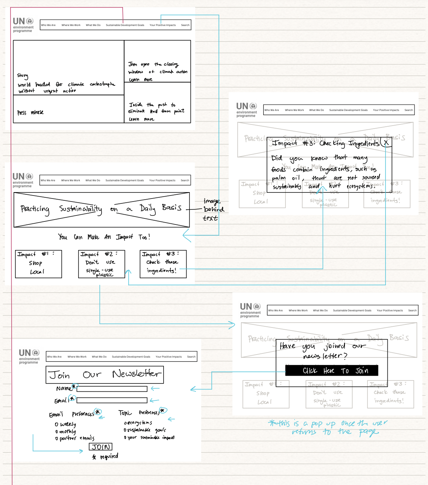
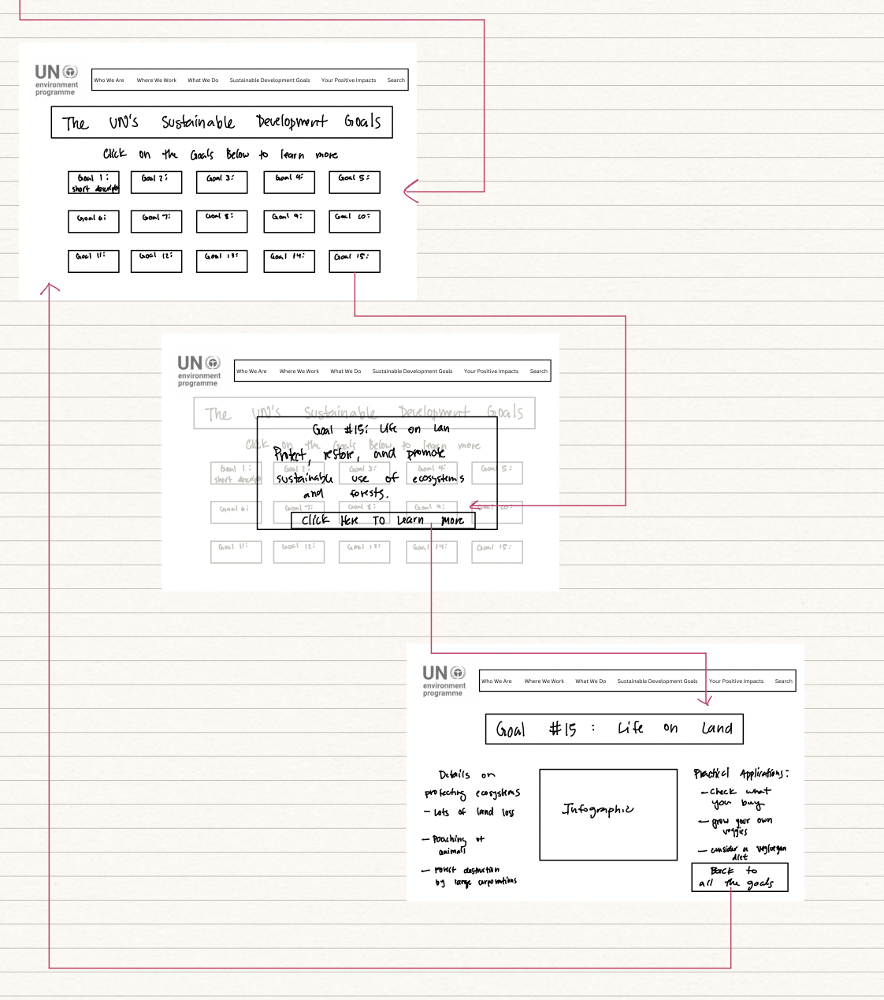

# [Gaining Easier Access to Sustainability Issues and Solutions: UN Environment Programme Website Redesign](https://dpurohit108.github.io/DH110-F22-DHRUVP/)

By: Dhruv Purohit, Digital Humanities 110 - Fall 2022

## About the Project
The goal of this project is to redesign the current [UN Environment Programme](https://www.unep.org) website to make it more accessible. The framework for this project started when given the task to choose one of the UN's sustainable development goals as a general topic. The focus for this project was goal 15, entitled life on land. The essence behind goal 15 is to "Protect, restore and promote sustainable use of terrestrial ecosystems, sustainably manage forests, combat desertification, and halt and reverse land degradation and halt biodiversity loss." 

The goal of this redesign process is to make the website more accessible, uniform, and usable. In doing so, the aim is to make it easier for the user to find relevant information on sustainability in a quick and efficient manner. With an overwhelming amount of information available on the web these days, users can easily become frustrated if they don't find relevant information quickly. The website was evaluated and design changes and decisions were made over the course of 7 assignments in an 8 week period. These assignments highlighted the following analytical and design elements: 
* Competitor Analysis (Heuristic Analysis & Usability Testing)
* User Research (Contextual Inquiry)
* UX Storytelling
* Wireframes & Wireflow
* Low-Fidelity Prototype
* User Interface Design
* High-Fidelity Prototype

## Design Statement

**The goal of this design is to preserve the genuine need for people to learn about environmental issues/topics while making access to such topics easy, efficient, and worth a user's time.** Through this redesign, I hope to impact adults and the way they learn about sustainability issues & topics in a practical and efficient manner. The overall topic of sustainability and the environment can be overwhelming for people, so ensuring **easy and relevant** access is critical.

Currently, the site is difficult to navigate and disorganized. Additionally, information on the UN’s Sustainable Development Goals is difficult to locate with a few clicks. Therefore, one of the main goals is to make it easy for the user to find information on these goals and what they are. Based off of the research and testing I performed throughout this 8 week period, I came up with design changes that ultimately lead to the creation of a high fidelity prototype. Read on to learn about the research and design process and to discover the final product. 

## Competitor Analysis

### Heuristic Evaluation

The first step in this project was to choose two websites that fit the theme of the project (UN Sustainable Development Goal 15) and analyze various parts of the site to see is they passed Jacob Nielsen's [10 Usability Heuristics](https://www.nngroup.com/articles/ten-usability-heuristics/). For my analysis, I chose the [UN Environment Programme](https://www.unep.org/explore-topics/sustainable-development-goals/why-do-sustainable-development-goals-matter/goal-15) website and the [SDG Tracker](https://sdg-tracker.org/biodiversity) website. Each of the ten heuristics were analyzed with respect to the websites and given a severity rating. 

  

With the [UN Environment Programme](https://www.unep.org) website (the website chosen for re-design), there were **minor usability problems** (fixes that require low priority) in the following categories: 

1. Visibility of System Status
2. Error Prevention
3. Recognition Rather Than Recall

and **major usability problem** (critical fixes that need high priority) in the following categories: 

1. Match Between System and the Real World
2. Consistency and Standards 
3. Flexibility and Efficiency of Use
4. Aesthetic and Minimalist Design
5. Help Users Recognize, Diagnose, and Recover From Errors
6. Help and Documentation

Overall, the website looked functional at first look, however, when analyzing the 10 heuristics, numerous issues were found, including the overall organization of the website.

Further details on the heristic evluation can be found [here](https://github.com/dpurohit108/DH110-F22-DHRUVP/blob/main/Assignments/Assignment01.md).

### Usability Testing

Following the heuristic analysis and identification of issues on the website, usability testing was used to gain insight from an ideal user to see how they would react to certain tasks and navigate the website. This process was conducted in person, and recorded using zoom, in order to capture the screen and the facial expressions of the subject. For this test, a detailed [questionnaire](https://forms.gle/aDQhmGhYESiUeESB6) was created that would guide the user through background questions, pre-test questions, and four tasks (listed below). The tasks were centered around issues I noted through the heuristic analysis.

Task 1: Suppose you want to learn about the sustainable development goals and the progress being made to achieve them. Could you try these tasks?
* Navigate to the page on sustainable development goals
* Locate the colorful boxes that are associated with the goals
* Click on one of the goals to view more details
* Locate the page on measuring progress on the goals

Task 2: Suppose you work for a fossil fuel company and are trying to find out more information on what the UN Environment Programme highlights about chemical pollutants. Could you try these tasks?
* Navigate to the page on chemicals and pollution action
* Find information on the benefits of chemical control
* Find the main contributors to chemical pollution around the world

Task 3: Suppose you are a researcher and want to obtain details on publications and studies. Could you try these tasks?
* Navigate to the page on publications & data
* Navigate to the "see more" under publications
* Find publications on the topic of sustainable goals

Task 4: Suppose you want to sign up for the newsletter. 
* Navigate to the page to sign up for the newsletter

The full usability test can be found below.

<iframe width="640" height="360" src="https://www.youtube.com/embed/8J-7qhC3U3M" title="110 Recording" frameborder="0" allow="accelerometer; autoplay; clipboard-write; encrypted-media; gyroscope; picture-in-picture" allowfullscreen></iframe>

It was found that the issues that I had raised from the heuristic analysis were issues that the user faced while performing the usability testing. While the user was successful at completing a majority of the tasks (and subtasks) listed above, the user pointed out that the **most likely task** they would complete was **the most difficult and time consuming**. The user was frustrated and somewhat lost at numerous points throughout the testing process, and brought up specific issues pertaining to: 

* the search bar not working
* menu bar not being fully functional
* the lack of consnsistency
* overll poor design

Additional details on the usability testing can be found [here](https://github.com/dpurohit108/DH110-F22-DHRUVP/blob/main/Assignments/Assignment02.md).

## User Research - Contextual Inquiry

The user research part of this project involved a contextual inquiry. The contextual inquiry differed from the usability test in that it provided the test user with more general guidelines (rather than very specific tasks) to see how they navigated the website. The goal of the inquiry was to observe how the user interacted with the website in a more natural setting. In order to facilitate a smooth process with the user, I prepared [this contextual inquiry guide](https://docs.google.com/document/d/1_hTVyhpJece9Vag8-CkiOGD3xA3O7QO6d4-hGxfVV98/edit). This document highlighted all the activities that were to be completed by the user and included the following: 

1. Introductory/Background Questions: Asked to get a good understanding of the user's background and context with the topic.
2. Observations During Activities: Used to observe the user in their natural web search setting and to document findings.
3. Follow-up and Closing Questions: Ask the user about how they felt after the activities and get final thoughts.

The live audio of the contextual inquiry can be seen [here](https://otter.ai/u/aQG3mYb4LGc0YGww5LUdvX6DMto) in addition to the [transcript](https://docs.google.com/document/d/1pvMEFMXPk14b4ZPewLB4gMEG761O3jPGm6tfoEgZTPU/edit?usp=sharing) and [field notes](https://docs.google.com/document/d/18ZU6pHUanSxlVs3BWZ0hgp5_mV55YhYwhWyC_Xa9kd0/edit?usp=sharing).

This research aspect provided me with additional detail as to what to look for in an ideal site and how to improve the redesign. The process went well and the items that stood out to me the most were the following: 
1. How the user viewed the presentation of information on the site
2. The vast amount of information that the user found interesting
3. How quickly the user was willing to integrate a change/alternative into their life 

The user expressed that having a successful visit to the site depended on the clarity and simplicity of the information they read/received. At times, this process was challenging as it depended on the user speaking their mind while being guided through the inquiry, however, overall it went well and provided me with further insight on how to redesign the website.

Further details on the user research/contextual inquiry process can be found [here](https://github.com/dpurohit108/DH110-F22-DHRUVP/blob/main/Assignments/Assignment03.md).

## UX Storytelling

The purpose of the UX storytelling process is to gain better insight into various scenarios that users may experience with the website. This process allows for the designer (me) to be in the user's shoes and get a better feel for some of the challenges they may experience. Based off ot the previous three parts of the project (heuristic evaluation, usability testing, and user research), the following five design solutions/features were tested as part of the storytelling process: 

1. Consolidated top menu bar that is well organized and easy to navigate.
2. Clear identification of the tab to find information on the sustainable development goals (identifiable using words).
3. Clear identification and list of the goals, with the user being able to quickly click on one of the colorful boxes to gain more information/detail on a specific goal.
4. Improved newsletter sign up that does not generate errors or take information that is not satisfactory. Additionally, providing information about what the newsletter will provide the user with and how often they will receive it.
5. A page that provides the user with simple and meaningful recommendations on changes they can make in their day to day life to have a positive impact towards achieving the sustainable goals.

Note: These generalized tasks/design solutions/features were re-defined in a more actionable way during the prototyping process. 

User personas and empathy maps (below) were created to get a better understanding of the user's background, thoughts, and actions. The two users created were **Kasey and Kennedy**. Their details can be viewed below. Additionally two different scenarios were written (one for each user) that highlighted their interactions with the website, background to why they are searching for certain information, and how they interact with the website. Kasey's scenario can be viewed [here](https://github.com/dpurohit108/DH110-F22-DHRUVP/blob/main/Assignments/Assignment04.md#kaseys-scenario--journey-map-design-features-4--5) and Kennedy's scenario can be viewed [here](https://github.com/dpurohit108/DH110-F22-DHRUVP/blob/main/Assignments/Assignment04.md#kennedys-scenario--journey-map-design-features-1-2--3). Journey maps were also created for each user to highlight their process (initiation, frustration, solution, and goal) and journey through the website. The journey maps can be viewed below. Overall, through this process, I was able to gain a better understanding of some of the issues potential users may face with this web design, and how I can strive to make their visit to the website worth their time. 

### User Personas

  
  

### Empathy Maps

  
  

### Journey Maps

  
  

Further details on the UX storytelling process and scenarios can be found [here](https://github.com/dpurohit108/DH110-F22-DHRUVP/blob/main/Assignments/Assignment04.md).

## Low-Fidelity Prototype (Initial Wireframes/Wireflow & Digitized Flow)

Low fidelity prototyping allows the designer to start putting design changes into actions. Following the information taken from the personas and prior testing, the basic design of the website was drafted. These initial wireframes were drawn by hand and did not include any graphical design or excessive content. The following tasks are supported by this low-fidelity prototype:

1. Find the list of all the sustainable development goals and find more details on goal 15 and the goal's challenges & solutions.
2. Find information on practical tips that the user can implement to have a positive impact towards the goals, specifically related to goal 15.
3. Subscribing to the newsletter to enable the user to stay engaged with the resources of the website.

The improved design also included the following aesthetic & navigation design changes: 

1. A new menu/navigation bar that better tells the user where they can find important information
2. Improved placement of the search bar
3. Identifiable ways for users to go back and exit certain windows/pages
4. Shorter, more interactive pages rather than the existing pages where scrolling is endless

  
  

The initial wireframe/flow can be found [here](https://drive.google.com/file/d/1-sVjBUB7t0LdEpBJ19MOJOiVNGyOJX5w/view?usp=sharing). Following the creation of these wireframes/flows, user testing was performed.  

User Testing Images: 

  
  
  

  
  
  

The wireframes and wireflow marked up by the user during the test can be found [here](https://drive.google.com/file/d/13IMag3i6l7X_jxVeZ39IRzsCy2On1VnU/view?usp=sharing). Overall, this testing process was very effective. I got to see first hand how it was to have someone attempt to interact with my website design. This testing process provided good feedback on how I could re-structure aspects of my flow and framing process. It was important to observe the issues the user faced while interacting with my design. A few highlights that the user provided me with were (1) ensuring that there is a "Click Here" or "Learn More" on every button or box that leads to something else, (2) providing feedback and confirmation after the user joins the newsletter, and (3) ensuring that there is option to close everything (everything!) that the user may click or open. The full feedback can be viewed [here](https://github.com/dpurohit108/DH110-F22-DHRUVP/blob/main/Assignments/Assignment05.md#insights-changes--reflections). Following the feedback I recieved from the user, I edited the wireframes/flow to reflect their feedback. The revised version of the wireframes/flow can be found [here](https://drive.google.com/file/d/1md260priQJqlqggeKWmV3ALyhA8StgBB/view?usp=sharing).

Further details on the wireframes can be found [here](https://github.com/dpurohit108/DH110-F22-DHRUVP/blob/main/Assignments/Assignment05.md).

**Prior to beginning the user interface process, the wireframe/flow (edited with user feedback) was digitized on Figma. The initial digitized wireflow can be found below. Note: Per instructor feedback, the design was converted to a mobile version instead of desktop.**

<iframe style="border: 1px solid rgba(0, 0, 0, 0.1);" width="800" height="450" src="https://www.figma.com/embed?embed_host=share&url=https%3A%2F%2Fwww.figma.com%2Ffile%2FAZGK2xOzvmFMts9cegN1mN%2FDigitized-Wireflow%3Fnode-id%3D0%253A1%26t%3Dv7UoJClQfxIDmy1K-1" allowfullscreen></iframe>

The use of the digitized flow in the interface design (Assignment 6) can be found [here](https://github.com/dpurohit108/DH110-F22-DHRUVP/blob/main/Assignments/Assignment06.md#wireframe-layout-choice)

## User Interface Graphic Design

The next step in the design process was to design the graphical interface of the website. Given the digitized wireflow that was created based off of the user feedback during the low-fidelity prototyping (see above), one website page was chosen to perform user interface & graphical design. I chose the "Goals List" page. The interface design process for this website included the following processes: 

1. Grid Design & Layout (aligning all items with a grid)
2. Typographic Design & Variations (designing & varying the text fonts)
3. Shape Design & Variations (designing & varying the shape of boxes/buttons)
4. Color Design & Variations (designing & varying the color options, specifically a light and dark mode)
5. Accessibility Check (check on color contrast)
6. User Impression Testing
7. Revisions from user feedback
8. Final Interface Design

The interace design process (from start to finish, with each step guided by arrows) can be found below. The color scheme was extracted from the logo using Adobe were used, in addition to a couple of other colors in order to add variation and to pass color contrast tests. All colors pass the color contrast accessibility check.  

<iframe style="border: 1px solid rgba(0, 0, 0, 0.1);" width="800" height="450" src="https://www.figma.com/embed?embed_host=share&url=https%3A%2F%2Fwww.figma.com%2Ffile%2FHlX4ncn8STQ01Od3mUnfZv%2FA6%253A-Interface-Design%3Fnode-id%3D0%253A1%26t%3DroNDWpXDMUy8XsqF-1" allowfullscreen></iframe>

Additional details on the user interface design process can be found [here](https://github.com/dpurohit108/DH110-F22-DHRUVP/blob/main/Assignments/Assignment06.md). 

## High-Fidelity Prototype

Following all of the research and testing mentioned above, it was time to create the high fidelity (fully functioning) prototype. The goal of this step was to bring together the interface design along with elements from the low fidelity prototype and digitized wireflow to create a fully functioning website. This prototype was a great way for me to see how the website flowed, given the design changes that I wanted to make. Prior to creating the high fidelity prototype, the digitized wireflow was re-created using the interface design. This can be found [here](https://www.figma.com/file/70jzqqbnqGPVP5KZgTsiL1/Updated-Flow?node-id=0%3A1&t=hHNvR5jRHP892VcB-1).

The following tasks are supported by this interactive prototype:

1. Find the list of all the sustainable development goals and find more details on goal 15 and the goal's challenges & solutions.
2. Find information on practical tips that the user can implement to have a positive impact towards the goals, specifically related to goal 15.
3. Subsribing to the newsletter to enable the user to stay engaged with the resources of the website.

The high fidelity prototype can be found below.

<iframe style="border: 1px solid rgba(0, 0, 0, 0.1);" width="800" height="450" src="https://www.figma.com/embed?embed_host=share&url=https%3A%2F%2Fwww.figma.com%2Fproto%2F8pJf6XjZfpIPxfYtA0DmpO%2FHigh-Fidelity%3Fpage-id%3D0%253A1%26node-id%3D1%253A101%26viewport%3D566%252C307%252C0.11%26scaling%3Dscale-down%26starting-point-node-id%3D1%253A101" allowfullscreen></iframe>

Further details on the high-fidelity prototype can be found [here](https://github.com/dpurohit108/DH110-F22-DHRUVP/blob/main/Assignments/Assignment07.md).

## Further Evaluations & Revisions

### Accessibility Check (Evaluated During User Interface Design Process)

During the user interface design process, the color contrasts were conducted using the the [Spark](https://www.getstark.co/) plugin. The results can be seen below. 

  
  
  
  

All of the color contrasts passed the WCAG 2.0 AA level. Three of the four tests did not pass the AAA level, however, since all the text falls into the "large text" category and since we are primarily concerned with the AA test, I came to the conclusion that the chosen colors were accessible. 

### Impression Testing (Evaluated During User Interface Design Process)

During the user interface design process, I conducted impression testing. As the user viewed my screen designs, I took note of the comments that were made, both positive and negative. I requested the user to give their impression of the current and final design choice. Following their initial, quick impression of my design, I asked them some further questions about the design to ensure that they were able to explain their thinking to me.

User quotes: 

* "The color choice is dynamic and catches my eye"
* "Adding some sort of symbol next to the newsletter sign-up would be nice"
* "The design is very symmetrical"
* "The page is filled with blue buttons, however, the black buttons stand out"
* "It would be helpful to have some context to the page. A small bit of text at the beginning would be ideal"

Overall, the user found my interface design pretty good and liked the design choices I made. I found that this test was a good and quick way to gain an initial impression on my design variations and decisions. The user was able to provide me with some feedback that led to some additional design changes. Details on the full impression test can be viewed [here](https://github.com/dpurohit108/DH110-F22-DHRUVP/blob/main/Assignments/Assignment06.md#impression-test). 

### Cognitive Walkthrough (Evaluated Following the High-Fidelity Prototype Development)

A cognitive walkthrough was performed following the creation of the high fidelity prototype. The purpose of this walkthrough is to gain user insight on potential issues or flaws with the near final design of the product. The users were asked to complete the three tasks highlighted/associated with the high fidelity prototype and make comments throughout the process. The walkthrough went smoothly and provided me with good insight on what aspects still needed fine tuning. The feedback provided included the following: 

* Ensuring uniformness across all pages
* Revising the colors on the main screen (for each news article)
* Providing context to the newsletter
* Ensuring that buttons stand out and are not confused by headers (particular to Goal 15 details page) 
* ...and more

To read about the full details of the cognative walkthrough, click [here](https://github.com/dpurohit108/DH110-F22-DHRUVP/blob/main/Assignments/Assignment07.md#cognitive-walkthrough-updated-following-in-class-cognitive-walkthrough). 

### Final Version Prototype 

The revised prototype includes the following improvements:

1. Changed colors of news articles/press releases to be consistent rather than different shades of blue.
2. Ensured that the logo at the top of the page consistently linked back to the home page. 
3. On the menu page, allow the user to return to the original menu when they click the up arrow on the sustainable development goals menu page. 
4. Ensure that the hamburger menu bar is accessible from additional pages. 
5. Redesign certain buttons to make them more intuitive and prominent. 
6. Modified text on Goal 15 Details page to be left justified.
7. Modified text headers on Goal 15 Details page to not look like buttons.
8. Moving some buttons to make the navigation easier
9. While the users said to maybe add icons instead of saying "Return to Home" I found that this was not the best idea as it made the button look less prominent and assumes that all users know that clicking a home icon will return them to the original home page. 

**Given all of the feedback I received during this process, I am pleased to present the final version of the redesign for the UN Environment Programme website below:**

<iframe style="border: 1px solid rgba(0, 0, 0, 0.1);" width="800" height="450" src="https://www.figma.com/embed?embed_host=share&url=https%3A%2F%2Fwww.figma.com%2Fproto%2FClu9FojG6FHp8pglP3ZQbl%2FHigh-Fidelity-(V2)%3Fpage-id%3D0%253A1%26node-id%3D1%253A101%26viewport%3D763%252C930%252C0.4%26scaling%3Dscale-down%26starting-point-node-id%3D1%253A101" allowfullscreen></iframe>

## Pitch Video

<iframe width="560" height="315" src="https://www.youtube.com/embed/DlEOiYJHYZM" title="YouTube video player" frameborder="0" allow="accelerometer; autoplay; clipboard-write; encrypted-media; gyroscope; picture-in-picture" allowfullscreen></iframe>

## Conclusion

This process has taught me so much about the research and design process that is necessary in order to create a successful product. At the beginning of the quarter, I had no idea that I was going to learn so many details on the design process. However, each assignment really showed me how important all the details are as part of the process. This was my first attempt at a UI/UX design & research project. From the very beginning, it was very evident that this process was to be driven by issues a potential user would face. Everything that I designed or modified had to be done with the user in mind. I found at times that we become used to certain things that a new user would not know how to use. Therefore, going back and thinking "will the user be able to do this" or "will the user understand the meaning of this'' with every design change is critical. Sometimes, all it can mean is adding more context, while at other times it can mean scrapping a current design for something totally different. While I spent a lot of time on each step in this process, there was a clear end goal and positive outcome that contributed in a meaningful way to the overall design process. 
 
If I were to expand this project and make it even more robust, I think it would be good to survey a wide variety of users and conduct more testing throughout the design process. Overall, the more feedback that is received, the better chances that the website will work for a wider variety of people. This was my first time using Figma, and I learned a lot. However, as I become more familiar with the functions Figma provides, it is possible to continue to improve the various prototypes and design features. Overall, I enjoyed learning about UI/UX design and putting it into practice all quarter long with this project. I also feel that I achieved my goal of redesigning the UNEP website to make access to environmental and sustainability topics easy, efficient, and worth a user's time while also maintaining the importance and relevance of these topics. 
